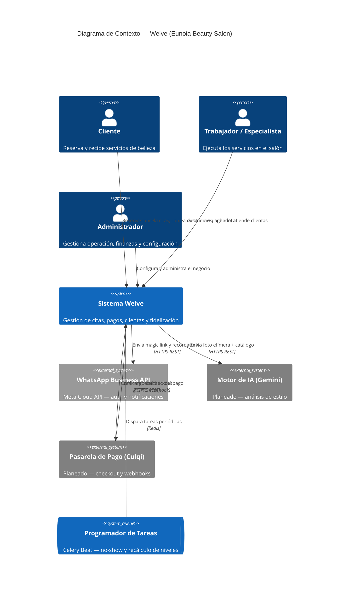
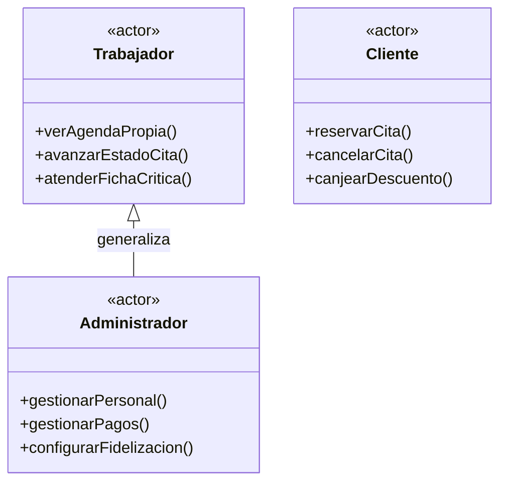

# Actores de Negocio

Un actor representa un rol que interactúa con el sistema — no necesariamente una persona física
única (una misma persona puede encarnar distintos actores en distintos momentos; un mismo actor
puede ser encarnado por muchas personas). Welve tiene tres actores primarios (humanos, inician
casos de uso) y cuatro actores secundarios (sistemas externos o internos que el sistema invoca o
que invocan al sistema, sin iniciativa de negocio propia).

## Actores primarios

### Cliente

- **Descripción**: persona que reserva y recibe servicios de belleza en Eunoia. Es el actor con
  mayor volumen de interacciones (todo el flujo de reserva, cancelación, pago de depósito,
  fidelización) pero el de menor superficie de permisos — actúa exclusivamente sobre sus propios
  datos.
- **Responsabilidades**: reservar/cancelar sus citas, mantener su perfil actualizado, canjear
  descuentos, y (planeado) usar la asesoría de IA y comprar en el catálogo exclusivo.
- **Contexto de uso**: móvil, generalmente fuera del salón (desde casa, en movimiento). Sesión
  iniciada sin contraseña (magic link por WhatsApp) — ver `docs/PRODUCT.md`.
- **Frecuencia**: alta (es, en volumen, el actor con más transacciones del sistema).
- **Casos de uso que inicia**: CU-C01–CU-C11 (ver `02_CASOS_DE_USO_UML.md`).

### Trabajador / Especialista

- **Descripción**: personal operativo del salón que ejecuta los servicios (estilistas,
  manicuristas, etc.). Interactúa con el sistema entre tratamientos, con las manos
  frecuentemente ocupadas — cada interacción debe ser mínima y rápida.
- **Responsabilidades**: gestionar su propia agenda del día, registrar la llegada y el avance de
  estado de sus citas, atender alertas de salud críticas, y (planeado) usar la asesoría de IA en
  vivo durante la atención.
- **Contexto de uso**: tablet o móvil compartido en el salón. Sesión con email + contraseña.
- **Frecuencia**: media-alta, concentrada en horario de atención del salón.
- **Restricción de diseño explícita**: nunca ve datos financieros del salón ni citas de otras
  especialistas — es un actor deliberadamente acotado, no una versión "reducida" del
  administrador.
- **Casos de uso que inicia**: CU-T01–CU-T09.

### Administrador

- **Descripción**: dueña o gerente del salón. Único actor con visión completa del negocio:
  operación, finanzas y configuración.
- **Responsabilidades**: gestión de personal, servicios, pagos, clientas (incluyendo bloqueo y
  fichas de salud), configuración de fidelización, y (planeado) configuración de los módulos de
  IA y catálogo exclusivo.
- **Contexto de uso**: escritorio o tablet en el back-office. Sesión con email + contraseña.
- **Frecuencia**: media, pero de alto valor por transacción (decisiones de configuración y
  conciliación financiera).
- **Relación con el actor Trabajador**: el Administrador **generaliza** al Trabajador — puede
  ejecutar todo lo que un Trabajador puede (operar cualquier cita, no solo las propias), más las
  secciones exclusivas de gestión. En UML esto se modela como una relación de generalización
  (flecha de herencia) desde `Trabajador` hacia `Administrador`.
- **Casos de uso que inicia**: CU-A01–CU-A12, más todos los de Trabajador sobre cualquier
  especialista.

### Diagrama de contexto (actores × sistema)

Notación **C4 Model — Nivel 1 (System Context Diagram)**, el estándar profesional actual para
representar actores humanos y sistemas externos alrededor de un sistema (equivalente formal al
diagrama de actores de UML, con la ventaja de distinguir explícitamente actor humano
(`Person`) de sistema externo (`System_Ext`) y de mostrar el límite del sistema (`System`) sin
ambigüedad:

### Diagrama de generalización de actores

UML formal: `Actor` es un clasificador, y la relación de herencia entre actores se representa
con una flecha de generalización (triángulo hueco) — el Administrador hereda todas las
capacidades del Trabajador y añade las propias:

## Actores secundarios

### WhatsApp Business API (Meta Cloud API)

- **Naturaleza**: sistema externo, ya integrado.
- **Rol en el sistema**: canal exclusivo de autenticación de clientes (magic link) y de
  notificaciones salientes (recordatorios de cita, y — planeado — notificaciones de
  fidelización/IA). Nunca inicia una interacción por sí mismo hacia Welve: Welve lo invoca
  (`utils/whatsapp.py`), nunca al revés (no hay webhook entrante de WhatsApp implementado).
- **Protocolo**: HTTP REST sobre HTTPS, autenticado con `WHATSAPP_TOKEN`.

### Motor de IA — Gemini (planeado)

- **Naturaleza**: sistema externo, módulo `docs/MODULO_ASESORIA_IA.md`, no implementado aún.
- **Rol en el sistema**: recibe una imagen efímera + los atributos del catálogo de estilos, y
  devuelve un ranking de sugerencias. No persiste nada del lado de Welve más allá de esa
  respuesta — es un actor puramente sincrónico dentro de una única request.
- **Protocolo**: HTTP REST sobre HTTPS, autenticado con `GEMINI_API_KEY`.

### Pasarela de Pago — Culqi (planeado)

- **Naturaleza**: sistema externo, módulo `docs/MODULO_FIDELIZACION_AVANZADA.md`, no
  implementado aún.
- **Rol en el sistema**: es el único actor secundario que **inicia** una interacción hacia
  Welve por su cuenta — el webhook de confirmación de pago (`POST /api/v1/webhooks/culqi`) es
  Culqi llamando a Welve, no al revés. Por eso ese endpoint se autentica por firma criptográfica
  en vez de por sesión de usuario.
- **Protocolo**: HTTP REST (Welve → Culqi para crear el cargo) + webhook HTTP (Culqi → Welve
  para confirmar el resultado).

### Programador de Tareas — Celery Beat

- **Naturaleza**: sistema interno (parte de la infraestructura propia de Welve, no un tercero),
  pero se modela como actor porque **inicia** casos de uso sin que ningún humano lo dispare
  directamente en ese momento — es quien realmente ejecuta RN05 (no-show automático) y,
  planeado, el recálculo periódico de niveles de fidelización (RN20).
- **Rol en el sistema**: dispara `verificar_no_show` cada 5 minutos y, planeado,
  `recalcular_niveles` en un intervalo configurable.
- **Protocolo**: interno — llamada de función Python vía Redis como broker de mensajes, sin red
  externa.

## Matriz actor × módulo (resumen)

Ver `docs/ROLES_Y_PERMISOS.md` para la matriz completa de permisos ver/crear/editar/eliminar por
módulo — esta tabla es solo el resumen de qué actor participa en qué módulo, a nivel de negocio:

| Módulo | Cliente | Trabajador | Admin | WhatsApp | Gemini | Culqi | Beat |
|---|---|---|---|---|---|---|---|
| Autenticación | ✅ (magic link) | ✅ (password) | ✅ (password) | ✅ (envía enlace) | — | — | — |
| Citas | ✅ | ✅ | ✅ | — | — | — | ✅ (RN05) |
| Pagos (manual) | — | — | ✅ | — | — | — | — |
| Fidelización actual | ✅ | — | ✅ | — | — | — | — |
| Fidelización avanzada *(planeado)* | ✅ | (informativo) | ✅ | ✅ (notif.) | — | ✅ | ✅ (RN20) |
| Asesoría IA *(planeado)* | ✅ | ✅ | ✅ | ✅ (notif.) | ✅ | — | — |
