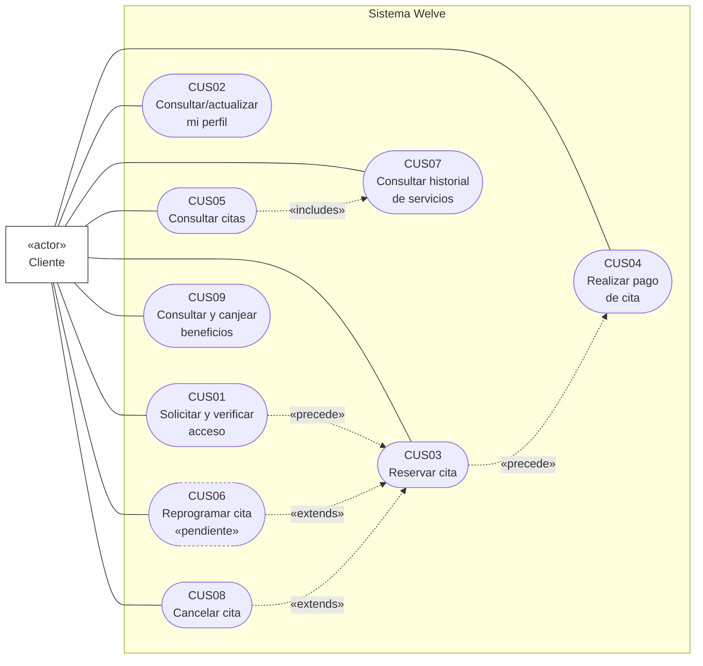
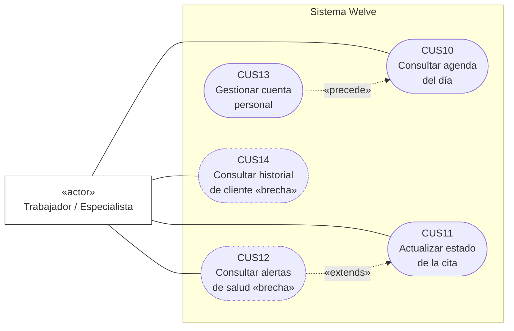
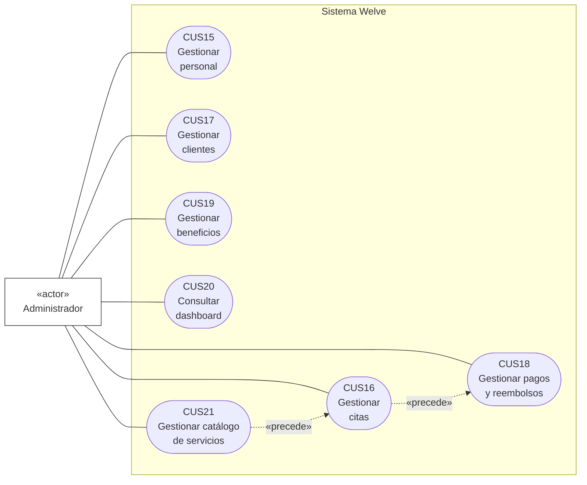
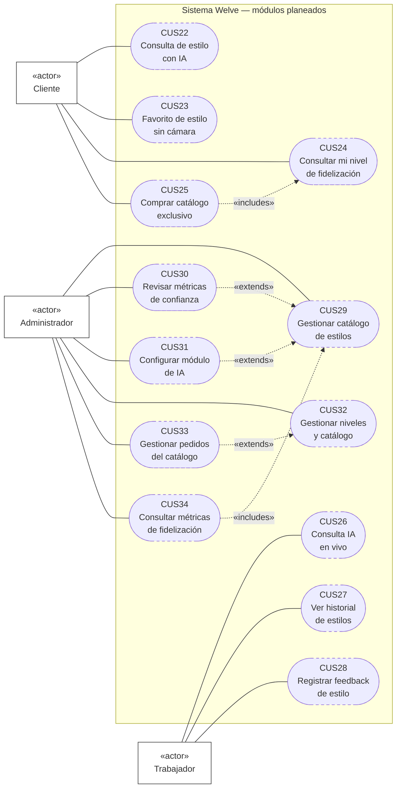

# Casos de Uso (UML)

Mermaid no tiene un tipo de diagrama nativo para "caso de uso" UML (actores + óvalos); se
aproxima con `flowchart` siguiendo la notación formal UML tal como la define el estándar cuando
la herramienta no soporta el pictograma de "muñeco de palitos": el actor se representa como un
rectángulo con el estereotipo **«actor»** (notación de clasificador, válida en el metamodelo
UML — el muñeco de palitos es solo el ícono por defecto, no la única representación permitida),
y cada caso de uso como una **elipse** (forma `stadium` de Mermaid, la aproximación visual más
cercana a un óvalo dentro de sus formas nativas), todo dentro de un `subgraph` que representa el
límite del sistema («system boundary»).

Cada caso de uso conserva el ID de `docs/CASOS_DE_USO.md` para que ambos documentos queden
sincronizados. Las relaciones «extends»/«includes»/«precede» de UML se marcan con flecha
punteada y su estereotipo correspondiente, tal como exige la notación formal.

> **Revisión actual — renumeración completa**: el catálogo pasó de tres rangos por actor
> (`CU-C0x`/`CU-T0x`/`CU-A0x`, 32 casos de uso en total) a un solo espacio de numeración
> compartido, **CUS01–CUS21** (catálogo oficial, alineado a los entregables TP1–TP4 del curso),
> más un apéndice de 13 casos de uso planeados renumerados **CUS22–CUS34**. Los casos
> redundantes de cancelar cita (antes `CU-C02`/`CU-C03`) y de avanzar-estado/ficha-crítica/
> no-show (antes `CU-T02`/`CU-T03`/`CU-T09`) se fusionaron en uno solo cada uno (`CUS08`,
> `CUS11`); se agregaron seis casos de uso que ya existían como endpoint pero no tenían ficha
> propia (`CUS04`, `CUS05`, `CUS07`, `CUS16`, `CUS21`, y `CUS06` como caso **pendiente** — sin
> backend implementado). El mapeo completo hacia la numeración anterior está al final de este
> documento. **Total: 34 casos de uso especificados** — 21 oficiales (19 implementados, 1
> pendiente de implementar — `CUS06` —, y 2 con brecha de permisos por resolver — `CUS12`,
> `CUS14`) + 13 planeados de los módulos futuros.

## Diagrama de casos de uso — Cliente

## Diagrama de casos de uso — Trabajador / Especialista

> `CUS12` y `CUS14` se dibujan con el mismo trazo punteado que "planeado" pero con su propio
> estereotipo — no son funcionalidad futura, son endpoints que **ya existen** pero con el guard
> de rol puesto en `admin` en vez de `admin`/`trabajador` (ver la ficha de cada uno para el
> archivo y línea exactos). `CUS13` no tiene arista propia hacia `CUS12`/`CUS14` porque no hay
> una relación de inclusión directa, solo la misma sesión de staff como precondición común.

## Diagrama de casos de uso — Administrador

> El Administrador además **generaliza** al Trabajador (ver
> `01_ACTORES_DE_NEGOCIO.md#diagrama-de-generalización-de-actores`): puede ejecutar `CUS11` sobre
> cualquier especialista, no solo repetir sus propios casos de uso. Esa relación de herencia se
> modela en el diagrama de actores, no aquí, para no duplicar los óvalos de Trabajador dentro del
> diagrama de Administrador.

---

## Especificación detallada de casos de uso

Formato de cada ficha: **ID**, **Nombre**, **Actor(es)**, **Tipo** (primario/secundario según si
el sistema lo hace por sí solo o a pedido directo), **Prioridad**, **Precondición**, **Flujo
normal** (numerado), **Flujos alternativos**, **Postcondición**, **Reglas de negocio**.

### Cliente

#### CUS01 — Solicitar y verificar acceso por magic link

- **Actor**: Cliente. **Tipo**: primario. **Prioridad**: alta. **Precede a**: CUS03 (toda acción
  del cliente requiere sesión iniciada).
- **Precondición**: ninguna (es el punto de entrada del cliente al sistema).
- **Flujo normal**: 1. El cliente ingresa su teléfono. 2. El sistema busca o crea el `Usuario` y
  el `Cliente` asociado, genera un `MagicLink` (token UUID, TTL 1h) y lo envía por WhatsApp si
  `acepta_whatsapp=true`. 3. El cliente abre el enlace recibido. 4. El sistema valida que el
  token no esté usado ni expirado, lo marca `usado=true` de forma atómica, y emite un JWT.
- **Flujos alternativos**: token ya usado o expirado → error, el cliente debe solicitar un
  nuevo enlace (vuelve al paso 1). `acepta_whatsapp=false` → el enlace no se envía por ese
  canal (limitación conocida, sin canal alternativo implementado).
- **Postcondición**: sesión de cliente iniciada (JWT emitido); el `MagicLink` queda inutilizado
  para siempre.
- **RN**: ninguna con ID propio — el TTL de 1 hora y el uso único son el mecanismo central de
  seguridad de este caso de uso.

#### CUS02 — Consultar y actualizar mi perfil

- **Actor**: Cliente. **Tipo**: primario. **Prioridad**: media.
- **Precondición**: sesión iniciada.
- **Flujo normal**: 1. El cliente abre su perfil. 2. El sistema muestra nombre, teléfono y
  correo actuales. 3. El cliente edita los campos que desee. 4. El sistema valida unicidad de
  correo/teléfono antes de guardar.
- **Flujos alternativos**: correo o teléfono ya usado por otra cuenta → 409.
- **Postcondición**: `Usuario` actualizado.
- **RN**: ninguna específica.

#### CUS03 — Reservar cita

- **Actor**: Cliente. **Tipo**: primario. **Prioridad**: alta.
- **Precondición**: sesión iniciada; `Cliente.esta_bloqueada = false`.
- **Flujo normal**:
  1. El cliente abre la vista de reserva y selecciona uno o más servicios.
  2. El sistema muestra especialistas disponibles para esos servicios.
  3. El cliente elige especialista y horario dentro de la disponibilidad real (ya descontando
     buffer y citas existentes).
  4. El sistema valida bloqueo (RN11), ficha de salud si corresponde (RN08) y solapamiento
     (RN13).
  5. El sistema crea la `Cita` en estado `pendiente` con sus `CitaServicio` asociados.
  6. El sistema confirma la reserva al cliente y muestra el depósito requerido (CUS04).
- **Flujos alternativos**:
  - 4a. Cliente bloqueada → el sistema rechaza con mensaje genérico (RN11), fin de caso de uso.
  - 4b. Servicio requiere ficha de salud inexistente → 422, el sistema indica contactar al
    salón.
  - 4c. Horario ya no disponible (carrera con otra reserva) → 409, se refresca la
    disponibilidad y se vuelve al paso 3.
- **Postcondición**: `Cita` persistida en `pendiente`.
- **RN**: RN08, RN11, RN13.

#### CUS04 — Realizar pago de cita

- **Actor**: Cliente. **Tipo**: primario. **Prioridad**: alta. **Sigue a**: CUS03.
- **Precondición**: `Cita` en `pendiente` con depósito pendiente de pago.
- **Flujo normal**: 1. El sistema muestra el monto de `servicio.monto_deposito`. 2. El cliente
  paga fuera del sistema (Yape, Plin, transferencia o efectivo — no hay pasarela integrada
  todavía, ver `docs/FASES.md` Fase 3). 3. El cliente envía el comprobante por WhatsApp o lo
  presenta en el local. 4. El admin registra el pago (CUS18) y lo confirma tras verificar el
  comprobante.
- **Flujos alternativos**: comprobante rechazado por el admin → el cliente debe reenviarlo (ver
  CUS18).
- **Postcondición**: `Pago` con `tipo=deposito` y `estado=confirmado`.
- **RN**: ninguna con ID propio — el monto nunca es un valor fijo, siempre
  `servicio.monto_deposito` (configurado en CUS21).

#### CUS05 — Consultar citas

- **Actor**: Cliente. **Tipo**: primario. **Prioridad**: media. **Incluye**: CUS07 (mismo
  endpoint, distinto filtro de presentación).
- **Precondición**: sesión iniciada.
- **Flujo normal**: 1. El cliente abre "Mis citas". 2. El sistema devuelve todas sus citas
  enriquecidas con nombre de especialista y servicios. 3. La vista agrupa como "próximas" las
  que están en `pendiente`, `confirmada` o `en_curso`.
- **Postcondición**: ninguna — caso de uso de solo consulta.
- **RN**: ninguna específica.

#### CUS06 — Reprogramar cita «pendiente»

- **Actor**: Cliente. **Tipo**: primario. **Prioridad**: media (deseada). **Extiende**: CUS03.
- **Estado**: **no implementado** — no existe endpoint de reprogramación en
  `backend/app/routers/citas.py` hoy. Ficha especificada para quedar lista de construir, no
  documenta comportamiento real.
- **Precondición (deseada)**: cita propia en `pendiente`/`confirmada`, con al menos las horas de
  anticipación de `servicio.horas_cancelacion_sin_penalidad` (mismo umbral de RN01).
- **Flujo normal (deseado)**: 1. El cliente elige un nuevo horario/especialista para una cita
  existente. 2. El sistema revalida disponibilidad (RN13) y ficha de salud (RN08) igual que en
  CUS03. 3. El sistema actualiza `programada_en`/`termina_en` sin crear una `Cita` nueva ni
  tocar el `Pago` ya confirmado.
- **Flujos alternativos (deseados)**: fuera de la ventana de anticipación → se ofrece CUS08 en
  su lugar. Nuevo horario no disponible → 409, igual que en CUS03.
- **Postcondición (deseada)**: `Cita` reprogramada, sin impacto en el depósito ya pagado.
- **RN**: ninguna todavía — candidatas: RN01 (techo de anticipación mínima), RN13 (nueva franja).

#### CUS07 — Consultar historial de servicios

- **Actor**: Cliente. **Tipo**: primario. **Prioridad**: baja. **Incluido en**: CUS05 (mismo
  endpoint).
- **Precondición**: sesión iniciada.
- **Flujo normal**: 1. El cliente abre la sección de historial dentro de "Mis citas". 2. El
  sistema filtra, del mismo resultado de CUS05, las citas en estado terminal (`completada`,
  `cancelada`, `cancelada_tardia`, `no_show`).
- **Postcondición**: ninguna — caso de uso de solo consulta.
- **RN**: ninguna específica.

#### CUS08 — Cancelar cita

- **Actor**: Cliente. **Tipo**: primario. **Prioridad**: alta. **Extiende**: CUS03.
- **Precondición**: cita propia en `pendiente` o `confirmada`.
- **Flujo normal**: 1. Cliente solicita cancelar con motivo opcional. 2. El sistema calcula
  horas restantes vs. `servicio.horas_cancelacion_sin_penalidad`.
  - 3a. Si horas restantes ≥ umbral → `Cita.estado = cancelada`, `penalizacion_aplicada =
    false`, reembolso completo del depósito (proceso manual de admin, CUS18) (RN01).
  - 3b. Si horas restantes < umbral → `Cita.estado = cancelada_tardia`,
    `penalizacion_aplicada = true`, pierde el depósito (RN02).
- **Flujos alternativos**: estado no cancelable (p. ej. `en_curso`/`completada`) → 422.
- **Postcondición**: cita en `cancelada` o `cancelada_tardia` según la rama.
- **RN**: RN01, RN02.

#### CUS09 — Consultar y canjear beneficios de fidelización

- **Actor**: Cliente. **Tipo**: primario (consulta y canje) + secundario (el premio de reto se
  genera solo). **Prioridad**: media.
- **Precondición**: sesión iniciada; para el canje, código de descuento vigente con cupo
  disponible.
- **Flujo normal**: 1. El cliente consulta sus retos en curso y sus descuentos disponibles.
  2. Al pagar una cita (CUS04), ingresa un código de descuento. 3. El sistema bloquea la fila
  del descuento (`SELECT ... FOR UPDATE`) para serializar canjes concurrentes. 4. Valida
  vigencia, `max_usos_global` y `max_usos_por_cliente` (RN14). 5. Registra `DescuentoUso`.
- **Flujo automático (secundario)**: al completarse una cita (CUS11 marca `completada`), el
  sistema evalúa todos los retos activos contra el historial del cliente; si uno se cumple,
  genera un `Descuento` premio único e idempotente (`ON CONFLICT DO NOTHING`) (RN15), sin que
  el cliente reclame nada.
- **Flujos alternativos**: código inexistente/inactivo → 404. Fuera de vigencia o cupo agotado →
  422.
- **Postcondición**: `DescuentoUso` persistido, ligado a cita y cliente; o nuevo `Descuento`
  disponible para el cliente sin acción explícita suya.
- **RN**: RN14, RN15.

### Trabajador / Especialista

#### CUS10 — Consultar agenda del día

- **Actor**: Trabajador. **Tipo**: primario. **Prioridad**: alta.
- **Precondición**: sesión iniciada con rol `trabajador` (o `admin`).
- **Flujo normal**: 1. El trabajador abre su agenda. 2. El sistema resuelve `Personal` por
  `usuario_id` y devuelve únicamente sus propias citas del día.
- **Postcondición**: agenda mostrada, sin datos de otras especialistas ni financieros.
- **RN**: ninguna específica — regla de aislamiento de datos por rol.

#### CUS11 — Actualizar estado de la cita

- **Actor**: Trabajador (o Admin, sobre cualquier cita — CUS16); Programador de Tareas — Celery
  Beat (dispara la rama automática). **Tipo**: primario + secundario (rama automática).
  **Prioridad**: alta.
- **Precondición**: cita asignada a esa especialista (si el actor es Trabajador); transición
  permitida según `_TRANSICIONES_VALIDAS`.
- **Flujo normal**: 1. Registra `hora_llegada_real`. 2. Confirma la cita. 3. Al llegar la
  clienta, pasa a `en_curso`. 4. Al terminar, pasa a `completada` (dispara CUS09).
- **Flujos alternativos**:
  - Transición no permitida por la tabla de estados → 422.
  - Ficha de salud crítica sin confirmar al pasar a `en_curso` → 422 con
    `codigo: FICHA_CRITICA` y el detalle de las fichas (ver CUS12); la especialista reenvía la
    petición con `confirmar_ficha_critica: true` para proceder (RN09).
  - **Rama automática**: cita `confirmada` con `programada_en + 15min < now()` y sin
    `hora_llegada_real` → Celery Beat la marca `no_show` cada 5 minutos, con la misma pérdida de
    depósito que un no-show marcado manualmente (RN05). Las citas en `pendiente` nunca se ven
    afectadas.
- **Postcondición**: estado de cita actualizado.
- **RN**: RN05, RN09, RN15.

#### CUS12 — Consultar alertas de salud de la clienta «brecha de permisos»

- **Actor**: Trabajador. **Tipo**: primario (deseado). **Prioridad**: media. **Extiende**:
  CUS11.
- **Estado**: **brecha de permisos** — `GET /clientes/{cliente_id}/fichas-salud` existe pero
  tiene `requerir_rol("admin")` en `backend/app/routers/clientes.py`; la especialista solo ve
  la alerta de forma reactiva, dentro del 422 de CUS11.
- **Precondición (deseada)**: cita propia agendada con esa clienta.
- **Flujo normal (deseado)**: 1. La especialista abre el detalle de una cita en su agenda.
  2. El sistema muestra las fichas de salud registradas de esa clienta (tipo de restricción,
  descripción, severidad), antes de que la clienta llegue.
- **Postcondición**: ninguna — caso de uso de solo consulta.
- **RN**: RN08, RN09.

#### CUS13 — Gestionar cuenta personal

- **Actor**: Trabajador o Admin. **Tipo**: primario. **Prioridad**: alta (autenticación) / baja
  (autogestión de perfil). **Precede a**: CUS10.
- **Precondición**: cuenta de staff ya creada (por auto-registro o por CUS15).
- **Flujo normal**: 1. El staff ingresa correo y contraseña. 2. El sistema valida credenciales
  y que `esta_activo=true`. 3. Emite un JWT. 4. Opcionalmente, consulta o edita su perfil
  (nombre/correo/teléfono) y cambia su contraseña indicando la actual.
- **Flujos alternativos**: credenciales inválidas → 401. Usuario desactivado → 403. Contraseña
  actual incorrecta → 401. Correo ya usado → 409.
- **Postcondición**: sesión de staff iniciada; o `Usuario` (y su hash de contraseña, si aplica)
  actualizado.
- **RN**: ninguna con ID propio.

#### CUS14 — Consultar historial de cliente «brecha de permisos»

- **Actor**: Trabajador. **Tipo**: primario (deseado). **Prioridad**: media.
- **Estado**: **brecha de permisos** — `GET /clientes/{cliente_id}/historial` existe pero tiene
  `requerir_rol("admin")`; el mismo caso que CUS12. Ampliar a
  `requerir_rol("admin", "trabajador")` no debería violar el aislamiento de datos del
  trabajador (es información de la clienta, no financiera ni de otra especialista).
- **Precondición (deseada)**: la clienta tiene al menos una cita previa en el salón.
- **Flujo normal (deseado)**: 1. La especialista abre el detalle de una clienta agendada.
  2. El sistema muestra su historial de citas anteriores (servicios, fecha, especialista).
- **Postcondición**: ninguna — caso de uso de solo consulta.
- **RN**: ninguna específica.

### Administrador

#### CUS15 — Gestionar personal

- **Actor**: Admin. **Tipo**: primario. **Prioridad**: alta. **Incluye**: creación de la cuenta
  de staff (mismo flujo que usa CUS13 para autenticarse después).
- **Flujo normal**: 1. Crea la cuenta `Usuario` con rol `trabajador`. 2. Crea el `Personal`
  asociado. 3. Define especialidad, comisión, tipo de contrato. 4. Define disponibilidad
  semanal (día/hora/buffer). 5. Administra cuentas de staff existentes: lista/consulta por rol
  y estado, edita nombre/teléfono, cambia correo (resetea `correo_verificado=false`), resetea
  contraseña, activa/desactiva.
- **RN**: RN13 (el buffer aquí definido es el que se valida en CUS03/CUS16).

#### CUS16 — Gestionar citas

- **Actor**: Admin. **Tipo**: primario. **Prioridad**: alta. **Precede a**: CUS18.
- **Flujo normal**: 1. Lista todas las citas del salón con filtros (no solo las propias, a
  diferencia de CUS10). 2. Crea una cita en nombre de un cliente (reserva telefónica o
  presencial), con las mismas validaciones que CUS03. 3. Avanza el estado o cancela cualquier
  cita usando los mismos endpoints que CUS11/CUS08, sin restricción de "solo mis citas".
- **Flujos alternativos**: los mismos de CUS03 (bloqueo, ficha faltante, solapamiento).
- **RN**: RN08, RN11, RN13 (compartidas con CUS03).

#### CUS17 — Gestionar clientes

- **Actor**: Admin. **Tipo**: primario. **Prioridad**: media.
- **Precondición**: sesión de admin iniciada.
- **Flujo normal**: 1. Lista clientes con sus etiquetas y estado de bloqueo. 2. Consulta el
  detalle de una clienta, incluyendo su historial de citas. 3. Edita etiquetas o notas internas
  (nunca `correo`/`password`, rechazados explícitamente por el schema — ver CUS15). 4. Registra
  o consulta sus fichas de salud (tipo de restricción, descripción, severidad). 5. Si
  corresponde, bloquea a la clienta indicando un motivo, o revierte un bloqueo previo.
- **Flujos alternativos**: intento de editar `correo` o `password` vía este flujo → 422 (usar
  CUS15). Cliente ya bloqueada intentando reservar → ver RN11 en CUS03.
- **Postcondición**: `Cliente` actualizado; si aplica, `esta_bloqueada` y `motivo_bloqueo` (o su
  reverso) persistidos; si aplica, nueva `FichaSalud` registrada.
- **RN**: RN08, RN11.

#### CUS18 — Gestionar pagos y reembolsos

- **Actor**: Admin. **Tipo**: primario. **Prioridad**: alta.
- **Precondición**: `Pago` en `pendiente` (confirmar/rechazar) o `confirmado` (reembolsar).
- **Flujo normal**: 1. Registra el pago que el cliente hizo fuera del sistema (CUS04).
  2. Revisa el comprobante fuera del sistema. 3. Confirma o rechaza manualmente. 4. Registra
  `confirmado_por` y `fecha_confirmacion`. 5. Si corresponde, registra el reembolso.
- **RN**: ninguna con ID propio — ejecuta la parte administrativa de RN01/RN02 decidida en
  CUS08.

#### CUS19 — Gestionar beneficios

- **Actor**: Admin. **Tipo**: primario. **Prioridad**: media.
- **Flujo normal**: crea `Descuento` (tipo, scope, código, valor, límites, vigencia) o `Reto`
  (visitas, ventana, recompensa) que los clientes consultan y canjean en CUS09.
- **Limitación actual**: solo crear y listar (ver `docs/FASES.md` para el plan de completar el
  CRUD en la Fase 3).
- **RN**: RN14 (los límites configurados aquí son los que valida el canje de CUS09).

#### CUS20 — Consultar dashboard

- **Actor**: Admin. **Tipo**: primario. **Prioridad**: alta.
- **Flujo normal**: el sistema carga en paralelo citas del día, pagos pendientes y personal
  activo; muestra KPIs en tipografía display bold.
- **Postcondición**: ninguna — caso de uso de solo consulta.
- **RN**: ninguna específica.

#### CUS21 — Gestionar catálogo de servicios

- **Actor**: Admin. **Tipo**: primario. **Prioridad**: alta. **Precede a**: CUS16.
- **Flujo normal**: 1. Crea y edita `Categoria`s. 2. Crea y edita `Servicio`s, incluyendo los
  campos que otros casos de uso leen en vez de un valor fijo: `duracion_minutos`, `precio`,
  `monto_deposito` (CUS04), `requiere_ficha_salud` (RN08), y
  `horas_cancelacion_sin_penalidad` (RN01/RN02). La lectura pública del catálogo (sin sesión) la
  usa CUS03/CUS16.
- **Postcondición**: `Categoria`/`Servicio` creado o actualizado.
- **RN**: ninguna con ID propio — es el punto de configuración de los umbrales que RN01/RN02/RN08
  usan en tiempo de reserva.

---

## Apéndice — Casos de uso planeados (fuera del alcance de TP1–TP4)

Mismos módulos que en `docs/CASOS_DE_USO.md` (asesoría de estilo con IA, fidelización avanzada
con catálogo exclusivo); se documentan con el mismo nivel de detalle porque forman parte del
diseño completo evaluado en la tesis, aunque no pertenezcan a ningún entregable del curso.

### Cliente

#### CUS22 — Consultar asesoría de estilo con IA *(planeado)*

- **Actor**: Cliente. **Tipo**: primario. **Prioridad**: media. **Incluye**: uso posterior en
  CUS03 (envío de la selección a la próxima cita).
- **Precondición**: módulo habilitado; consentimiento aceptado; límite diario no superado
  (RN18).
- **Flujo normal**: 1. El cliente activa la cámara y captura una foto. 2. El sistema la envía a
  Gemini junto con los atributos del catálogo. 3. Gemini devuelve un ranking de estilos del
  catálogo existente. 4. El sistema descarta la foto (RN17). 5. El cliente elige uno o más
  estilos y los envía a su especialista, ligados a su próxima cita (RN19).
- **Flujos alternativos**: sin consentimiento → la cámara no se activa (RN16). Límite diario
  alcanzado → mensaje con el tiempo de reseteo. Sin cita futura → selección guardada pero envío
  deshabilitado.
- **Postcondición**: `ConsultaIA` y, si aplica, `SeleccionEstilo` persistidos — nunca la foto.
- **RN**: RN16, RN17, RN18, RN19.

#### CUS23 — Marcar un estilo como favorito sin cámara *(planeado)*

- **Actor**: Cliente. **Tipo**: primario. **Prioridad**: baja.
- **Precondición**: catálogo de estilos con al menos un ítem activo.
- **Flujo normal**: 1. El cliente explora el catálogo directamente. 2. Marca uno o más como
  favoritos (`SeleccionEstilo` con `origen=favorito`, sin `ConsultaIA` asociada).
- **Postcondición**: favorito visible junto a las selecciones generadas por IA, sin distinción
  de origen para la especialista.
- **RN**: ninguna nueva.

#### CUS24 — Consultar mi nivel de fidelización y progreso *(planeado)*

- **Actor**: Cliente. **Tipo**: primario. **Prioridad**: media. **Extiende**: CUS25 (contexto de
  decisión de compra en el catálogo exclusivo).
- **Precondición**: módulo de fidelización avanzada habilitado.
- **Flujo normal**: 1. El cliente abre la sección de fidelización. 2. El sistema muestra el
  `NivelFidelizacion` actual y qué le falta (visitas o gasto) para alcanzar el siguiente nivel.
- **Postcondición**: ninguna — caso de uso de solo consulta.
- **RN**: RN20.

#### CUS25 — Comprar en el catálogo exclusivo *(planeado)*

- **Actor**: Cliente. **Tipo**: primario. **Prioridad**: media. **Incluye**: CUS09 (mismo
  concepto de canje, aplicado a un producto en vez de un servicio).
- **Precondición**: `cliente.nivel_actual ≥ producto.nivel_minimo`.
- **Flujo normal**: 1. El cliente ve el catálogo (productos de nivel superior bloqueados con
  teaser). 2. Elige un producto habilitado y paga vía Culqi. 3. El sistema crea `PedidoCatalogo`
  en `pendiente`. 4. Culqi confirma vía webhook. 5. El sistema actualiza el pedido a `pagado`
  de forma idempotente (RN23).
- **Flujos alternativos**: nivel insuficiente → 403 también a nivel de API (RN22). Pago
  rechazado → `cancelado`, sin efecto en el nivel (RN24).
- **Postcondición**: `PedidoCatalogo` en `pagado`.
- **RN**: RN20–RN24.

### Trabajador / Especialista

#### CUS26 — Consultar asesoría de estilo durante la atención *(planeado)*

- **Actor**: Trabajador. **Tipo**: primario. **Prioridad**: baja.
- **Flujo normal**: igual mecánica que CUS22, iniciada por la especialista durante la atención
  presencial; el resultado queda ligado a `personal_id` además de a la cita.
- **RN**: RN16, RN17, RN18, RN19.

#### CUS27 — Consultar historial de estilos de cliente *(planeado)*

- **Actor**: Trabajador. **Tipo**: primario. **Prioridad**: media.
- **Precondición**: la clienta tiene `SeleccionEstilo` previas ligadas a citas anteriores.
- **Flujo normal**: 1. La especialista abre el detalle de una cita agendada. 2. El sistema
  muestra el historial de estilos de esa clienta, sin volver a analizar ninguna foto.
- **RN**: RN19.

#### CUS28 — Registrar feedback de estilo *(planeado)*

- **Actor**: Trabajador. **Tipo**: primario. **Prioridad**: baja. **Extiende**: CUS11.
- **Precondición**: la cita tiene una `SeleccionEstilo` asociada y acaba de pasar a
  `completada`.
- **Flujo normal**: 1. La especialista marca si el resultado coincidió con el estilo elegido
  (sí/no + nota). 2. El sistema lo registra en `SeleccionEstilo.feedback_coincidio`.
- **Postcondición**: no afecta al cliente; alimenta la métrica de confianza del catálogo
  (CUS30).
- **RN**: ninguna nueva.

### Administrador

#### CUS29 — Gestionar catálogo de estilos *(planeado)*

- **Actor**: Admin (o especialista con permiso delegado). **Tipo**: primario. **Prioridad**:
  media. **Base de**: CUS30.
- **Flujo normal**: carga estilos de referencia (`EstiloCatalogo`) una sola vez, con imagen y
  atributos — única fuente de imágenes del módulo.
- **RN**: RN16–RN19.

#### CUS30 — Revisar métricas de confianza del catálogo de estilos *(planeado)*

- **Actor**: Admin. **Tipo**: primario. **Prioridad**: baja. **Extiende**: CUS29.
- **Precondición**: al menos un feedback registrado (CUS28).
- **Flujo normal**: el admin ve, por estilo, el porcentaje de feedback positivo, para decidir si
  ajustar o retirar el estilo del catálogo.
- **RN**: ninguna nueva.

#### CUS31 — Configurar módulo de asesoría IA *(planeado)*

- **Actor**: Admin. **Tipo**: primario. **Prioridad**: media. **Extiende**: CUS29.
- **Precondición**: módulo de IA implementado y disponible para configuración.
- **Flujo normal**: 1. El admin activa o desactiva el módulo. 2. Define el límite diario de
  consultas de IA por cliente.
- **Postcondición**: configuración persistida, efectiva en la siguiente consulta de
  CUS22/CUS26.
- **RN**: RN18.

#### CUS32 — Gestionar niveles y catálogo exclusivo *(planeado)*

- **Actor**: Admin. **Tipo**: primario. **Prioridad**: media.
- **Flujo normal**: define `NivelFidelizacion` (umbral y beneficios), carga
  `ProductoCatalogoExclusivo` con su `nivel_minimo`, consulta pedidos.
- **RN**: RN20–RN24.

#### CUS33 — Gestionar pedidos del catálogo exclusivo *(planeado)*

- **Actor**: Admin. **Tipo**: primario. **Prioridad**: media. **Extiende**: CUS32.
- **Precondición**: existe al menos un `PedidoCatalogo` en `pagado`.
- **Flujo normal**: 1. Filtra pedidos por estado/cliente/producto. 2. Abre el detalle. 3. Marca
  como `entregado` tras la entrega física.
- **Flujos alternativos**: marcar entregado un pedido no `pagado` → 422.
- **RN**: RN23.

#### CUS34 — Consultar métricas de fidelización *(planeado)*

- **Actor**: Admin. **Tipo**: primario. **Prioridad**: baja. **Incluido en**: CUS20 (widgets del
  dashboard operativo).
- **Precondición**: módulo de fidelización avanzada habilitado; al menos un cliente con nivel
  asignado.
- **Flujo normal**: 1. El admin abre el dashboard operativo. 2. El sistema muestra la
  distribución de clientes por nivel de fidelización y los ingresos del catálogo exclusivo del
  mes — agregados de solo lectura.
- **Postcondición**: ninguna — caso de uso de solo consulta.
- **RN**: ninguna nueva — lee el resultado de RN20/RN21 y de las compras de CUS25.

---

## Mapeo con la numeración anterior

| Anterior | Actual | Anterior | Actual | Anterior | Actual |
|---|---|---|---|---|---|
| CU-C01 | CUS03 | CU-T01 | CUS10 | CU-A01 | CUS15 |
| CU-C02 | CUS08 *(fusionado)* | CU-T02 | CUS11 *(fusionado)* | CU-A02 | CUS18 |
| CU-C03 | CUS08 *(fusionado)* | CU-T03 | CUS11 *(fusionado)* | CU-A03 | CUS19 |
| CU-C04 | CUS09 *(fusionado)* | CU-T07 | CUS13 | CU-A06 | CUS20 |
| CU-C05 | CUS09 *(fusionado)* | CU-T08 | CUS13 *(fusionado)* | CU-A09 | CUS17 |
| CU-C09 | CUS01 | CU-T09 | CUS11 *(fusionado)* | CU-A10 | CUS15 *(fusionado)* |
| CU-C10 | CUS02 | CU-T10 | CUS26 | CU-A11 | CUS29 |
| CU-C11 | CUS22 | CU-T11 | CUS27 | CU-A12 | CUS30 |
| CU-C12 | CUS23 | CU-T12 | CUS28 | CU-A13 | CUS31 |
| CU-C13 | CUS24 | — | CUS12 *(nuevo — brecha)* | CU-A14 | CUS32 |
| CU-C14 | CUS25 | — | CUS14 *(nuevo — brecha)* | CU-A15 | CUS33 |
| — | CUS04 *(nuevo)* | | | CU-A16 | CUS34 |
| — | CUS05 *(nuevo)* | | | — | CUS16 *(nuevo)* |
| — | CUS06 *(nuevo — pendiente)* | | | — | CUS21 *(nuevo)* |
| — | CUS07 *(nuevo)* | | | | |

*(nuevo)* = no tenía ficha de caso de uso propia antes, aunque el endpoint ya existía.
*(nuevo — pendiente)* = no tenía ficha ni endpoint. *(fusionado)* = dos o más fichas anteriores
se consolidaron en una sola, documentando las ramas como flujos alternativos.
