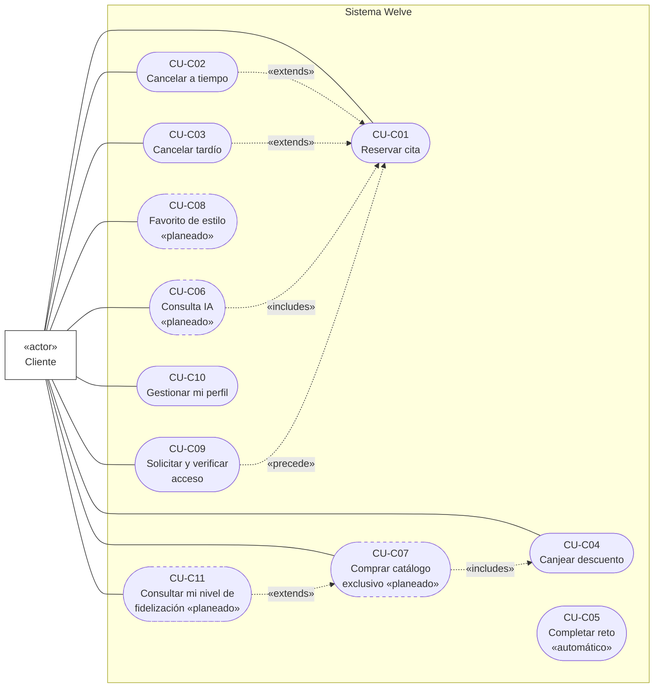
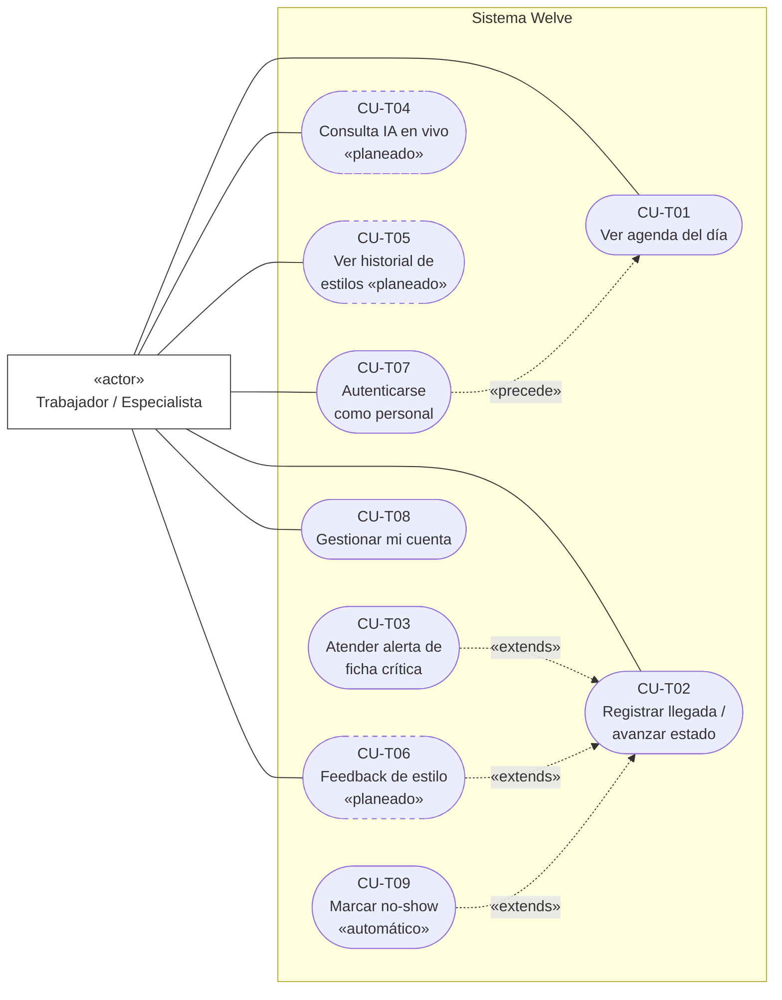
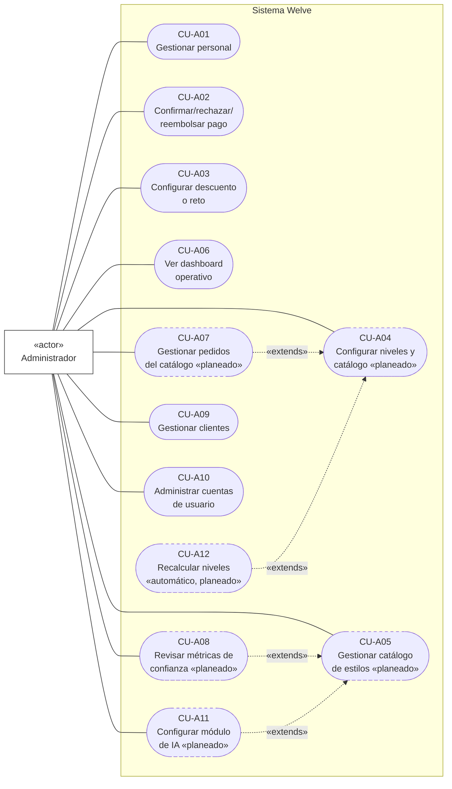

# Casos de Uso (UML)

Mermaid no tiene un tipo de diagrama nativo para "caso de uso" UML (actores + óvalos); se
aproxima con `flowchart` siguiendo la notación formal UML tal como la define el estándar cuando
la herramienta no soporta el pictograma de "muñeco de palitos": el actor se representa como un
rectángulo con el estereotipo **«actor»** (notación de clasificador, válida en el metamodelo
UML — el muñeco de palitos es solo el ícono por defecto, no la única representación permitida),
y cada caso de uso como una **elipse** (forma `stadium` de Mermaid, la aproximación visual más
cercana a un óvalo dentro de sus formas nativas), todo dentro de un `subgraph` que representa el
límite del sistema («system boundary»).

Cada caso de uso conserva el ID de `docs/CASOS_DE_USO.md` para que ambos documentos queden
sincronizados. Las relaciones «extends»/«includes» de UML se marcan con flecha punteada y su
estereotipo correspondiente, tal como exige la notación formal.

**Total de casos de uso especificados: 32** — 11 de Cliente (`CU-C01`–`CU-C11`), 9 de Trabajador
(`CU-T01`–`CU-T09`), 12 de Administrador (`CU-A01`–`CU-A12`). 19 ya implementados, 13 planeados
(marcados con borde punteado en los diagramas y con `«planeado»` en el texto).

> Los 10 casos de uso agregados en la última revisión (`CU-C09`–`CU-C11`, `CU-T07`–`CU-T09`,
> `CU-A09`–`CU-A12`) cierran la brecha detectada al auditar `11_REQUERIMIENTOS_FUNCIONALES.md`
> contra los 22 casos originales: había RF ya implementados (autenticación, gestión de
> clientes, administración de cuentas de usuario, no-show automático) y RF planeados
> (configuración del módulo de IA, recálculo de niveles, consulta de mi nivel de fidelización)
> sin un caso de uso que los agrupara. Ningún caso de uso existente cambió de número — se
> añadieron al final del rango de cada actor para no romper referencias cruzadas en el resto de
> `docs/`.

## Diagrama de casos de uso — Cliente

## Diagrama de casos de uso — Trabajador / Especialista

## Diagrama de casos de uso — Administrador

---

## Especificación detallada de casos de uso

Formato de cada ficha: **ID**, **Nombre**, **Actor(es)**, **Tipo** (primario/secundario según
si el sistema lo hace por sí solo o a pedido directo), **Prioridad**, **Precondición**, **Flujo
normal** (numerado), **Flujos alternativos**, **Postcondición**, **Reglas de negocio**.

### Cliente

#### CU-C01 — Reservar cita

- **Actor**: Cliente. **Tipo**: primario. **Prioridad**: alta.
- **Precondición**: sesión iniciada; `Cliente.esta_bloqueada = false`.
- **Flujo normal**:
  1. El cliente abre la vista de reserva y selecciona uno o más servicios.
  2. El sistema muestra especialistas disponibles para esos servicios.
  3. El cliente elige especialista y horario dentro de la disponibilidad real (ya descontando
     buffer y citas existentes).
  4. El sistema valida bloqueo (RN11), ficha de salud si corresponde (RN08) y solapamiento
     (RN13).
  5. El sistema crea la `Cita` en estado `pendiente` con sus `CitaServicio` asociados.
  6. El sistema confirma la reserva al cliente.
- **Flujos alternativos**:
  - 4a. Cliente bloqueada → el sistema rechaza con mensaje genérico (RN11), fin de caso de uso.
  - 4b. Servicio requiere ficha de salud inexistente → 422, el sistema indica contactar al
    salón.
  - 4c. Horario ya no disponible (carrera con otra reserva) → 409, se refresca la
    disponibilidad y se vuelve al paso 3.
- **Postcondición**: `Cita` persistida en `pendiente`.
- **RN**: RN08, RN11, RN13.

#### CU-C02 — Cancelar una cita a tiempo

- **Actor**: Cliente. **Tipo**: primario. **Prioridad**: alta. **Extiende**: CU-C01.
- **Precondición**: cita propia en `pendiente` o `confirmada`; horas restantes ≥
  `servicio.horas_cancelacion_sin_penalidad`.
- **Flujo normal**: 1. Cliente solicita cancelar con motivo opcional. 2. El sistema calcula
  horas restantes vs. umbral del servicio. 3. El sistema marca `Cita.estado = cancelada`,
  `penalizacion_aplicada = false`. 4. Se dispara el reembolso completo del depósito (proceso
  manual de admin).
- **Flujos alternativos**: si el umbral no se cumple → ver CU-C03. Si el estado no es cancelable
  → 422.
- **Postcondición**: cita en `cancelada`, sin penalidad.
- **RN**: RN01.

#### CU-C03 — Cancelar una cita fuera de ventana (tardía)

- **Actor**: Cliente. **Tipo**: primario. **Prioridad**: alta. **Extiende**: CU-C01.
- **Precondición**: cita propia en `pendiente` o `confirmada`; horas restantes <
  `servicio.horas_cancelacion_sin_penalidad`.
- **Flujo normal**: idéntico a CU-C02 hasta el paso 2; en el paso 3 el sistema marca
  `Cita.estado = cancelada_tardia`, `penalizacion_aplicada = true` (pierde el depósito).
- **Postcondición**: cita en `cancelada_tardia`, con penalidad.
- **RN**: RN02.

#### CU-C04 — Canjear un descuento

- **Actor**: Cliente. **Tipo**: primario. **Prioridad**: media.
- **Precondición**: código de descuento vigente, con cupo global y personal disponibles.
- **Flujo normal**: 1. El cliente ingresa el código al pagar una cita. 2. El sistema bloquea la
  fila del descuento (`SELECT ... FOR UPDATE`) para serializar canjes concurrentes. 3. Valida
  vigencia, `max_usos_global` y `max_usos_por_cliente` (RN14). 4. Registra `DescuentoUso`.
- **Flujos alternativos**: código inexistente/inactivo → 404. Fuera de vigencia o cupo agotado
  → 422.
- **Postcondición**: `DescuentoUso` persistido, ligado a cita y cliente.
- **RN**: RN14.

#### CU-C05 — Completar un reto de fidelización (automático)

- **Actor**: Cliente (pasivo — lo dispara el sistema, no una acción explícita del cliente).
  **Tipo**: secundario, disparado internamente al completar CU-T02. **Prioridad**: media.
- **Precondición**: reto activo y vigente; el cliente acumula suficientes citas `completada`
  dentro de la ventana del reto.
- **Flujo normal**: 1. Al completarse una cita (CU-T02), el sistema evalúa todos los retos
  activos contra el historial del cliente. 2. Si un reto se cumple, genera un `Descuento`
  premio único, idempotente (`ON CONFLICT DO NOTHING`).
- **Postcondición**: nuevo descuento disponible para el cliente sin acción explícita suya.
- **RN**: RN15.

#### CU-C06 — Consulta de asesoría de estilo con IA *(planeado)*

- **Actor**: Cliente. **Tipo**: primario. **Prioridad**: media. **Incluye**: uso posterior en
  CU-C01 (envío de la selección a la próxima cita).
- **Precondición**: módulo habilitado; consentimiento aceptado; límite diario no superado
  (RN18).
- **Flujo normal**: 1. El cliente activa la cámara y captura una foto. 2. El sistema la envía a
  Gemini junto con los atributos del catálogo. 3. Gemini devuelve un ranking de estilos del
  catálogo existente. 4. El sistema descarta la foto (RN17). 5. El cliente elige uno o más
  estilos y los envía a su especialista, ligados a su próxima cita (RN19).
- **Flujos alternativos**: sin consentimiento → la cámara no se activa (RN16). Límite diario
  alcanzado → mensaje con el tiempo de reseteo. Sin cita futura → selección guardada pero envío
  deshabilitado.
- **Postcondición**: `ConsultaIA` y, si aplica, `SeleccionEstilo` persistidos — nunca la foto.
- **RN**: RN16, RN17, RN18, RN19.

#### CU-C07 — Comprar en el catálogo exclusivo *(planeado)*

- **Actor**: Cliente. **Tipo**: primario. **Prioridad**: media. **Incluye**: CU-C04 (mismo
  concepto de canje, aplicado a un producto en vez de un servicio).
- **Precondición**: `cliente.nivel_actual ≥ producto.nivel_minimo`.
- **Flujo normal**: 1. El cliente ve el catálogo (productos de nivel superior bloqueados con
  teaser). 2. Elige un producto habilitado y paga vía Culqi. 3. El sistema crea `PedidoCatalogo`
  en `pendiente`. 4. Culqi confirma vía webhook. 5. El sistema actualiza el pedido a `pagado`
  de forma idempotente (RN23).
- **Flujos alternativos**: nivel insuficiente → 403 también a nivel de API (RN22). Pago
  rechazado → `cancelado`, sin efecto en el nivel (RN24).
- **Postcondición**: `PedidoCatalogo` en `pagado`.
- **RN**: RN20–RN24.

#### CU-C08 — Marcar un estilo como favorito sin cámara *(planeado)*

- **Actor**: Cliente. **Tipo**: primario. **Prioridad**: baja.
- **Precondición**: catálogo de estilos con al menos un ítem activo.
- **Flujo normal**: 1. El cliente explora el catálogo directamente. 2. Marca uno o más como
  favoritos (`SeleccionEstilo` con `origen=favorito`, sin `ConsultaIA` asociada).
- **Postcondición**: favorito visible junto a las selecciones generadas por IA, sin distinción
  de origen para la especialista.
- **RN**: ninguna nueva.

#### CU-C09 — Solicitar y verificar acceso por magic link

- **Actor**: Cliente. **Tipo**: primario. **Prioridad**: alta. **Precede a**: CU-C01 (toda
  acción del cliente requiere sesión iniciada).
- **Precondición**: ninguna (es el punto de entrada del cliente al sistema).
- **Flujo normal**: 1. El cliente ingresa su teléfono. 2. El sistema busca o crea el `Usuario` y
  el `Cliente` asociado, genera un `MagicLink` (token UUID, TTL 1h) y lo envía por WhatsApp si
  `acepta_whatsapp=true`. 3. El cliente abre el enlace recibido. 4. El sistema valida que el
  token no esté usado ni expirado, lo marca `usado=true` de forma atómica, y emite un JWT.
- **Flujos alternativos**: token ya usado o expirado → error, el cliente debe solicitar un
  nuevo enlace (vuelve al paso 1). `acepta_whatsapp=false` → el enlace no se envía por ese
  canal (limitación conocida, sin canal alternativo implementado).
- **Postcondición**: sesión de cliente iniciada (JWT emitido); el `MagicLink` queda inutilizado
  para siempre.
- **RN**: ninguna con ID propio — el TTL de 1 hora y el uso único son el mecanismo central de
  seguridad de este caso de uso.

#### CU-C10 — Consultar y actualizar mi perfil

- **Actor**: Cliente. **Tipo**: primario. **Prioridad**: media.
- **Precondición**: sesión iniciada.
- **Flujo normal**: 1. El cliente abre su perfil. 2. El sistema muestra nombre, teléfono y
  correo actuales. 3. El cliente edita los campos que desee. 4. El sistema valida unicidad de
  correo/teléfono antes de guardar.
- **Flujos alternativos**: correo o teléfono ya usado por otra cuenta → 409.
- **Postcondición**: `Usuario` actualizado.
- **RN**: ninguna específica.

#### CU-C11 — Consultar mi nivel de fidelización y progreso *(planeado)*

- **Actor**: Cliente. **Tipo**: primario. **Prioridad**: media. **Extiende**: CU-C07 (contexto
  de decisión de compra en el catálogo exclusivo).
- **Precondición**: módulo de fidelización avanzada habilitado.
- **Flujo normal**: 1. El cliente abre la sección de fidelización. 2. El sistema muestra el
  `NivelFidelizacion` actual y qué le falta (visitas o gasto) para alcanzar el siguiente nivel.
- **Postcondición**: ninguna — caso de uso de solo consulta.
- **RN**: RN20.

### Trabajador / Especialista

#### CU-T01 — Ver agenda del día

- **Actor**: Trabajador. **Tipo**: primario. **Prioridad**: alta.
- **Precondición**: sesión iniciada con rol `trabajador` (o `admin`).
- **Flujo normal**: 1. El trabajador abre su agenda. 2. El sistema resuelve `Personal` por
  `usuario_id` y devuelve únicamente sus propias citas del día.
- **Postcondición**: agenda mostrada, sin datos de otras especialistas ni financieros.
- **RN**: ninguna específica — regla de aislamiento de datos por rol.

#### CU-T02 — Registrar llegada y avanzar el estado de una cita

- **Actor**: Trabajador (o Admin). **Tipo**: primario. **Prioridad**: alta.
- **Precondición**: cita asignada a esa especialista (si el actor es Trabajador); transición
  permitida según `_TRANSICIONES_VALIDAS`.
- **Flujo normal**: 1. Registra `hora_llegada_real`. 2. Confirma la cita. 3. Al llegar la
  clienta, pasa a `en_curso`. 4. Al terminar, pasa a `completada` (dispara CU-C05).
- **Flujos alternativos**: transición no permitida → 422. Ficha crítica sin confirmar al pasar a
  `en_curso` → ver CU-T03.
- **Postcondición**: estado de cita actualizado.
- **RN**: RN09, RN15.

#### CU-T03 — Atender la alerta de ficha de salud crítica

- **Actor**: Trabajador. **Tipo**: primario. **Prioridad**: alta. **Extiende**: CU-T02.
- **Precondición**: la clienta tiene al menos una `FichaSalud` con `severidad='critica'` activa.
- **Flujo normal**: 1. Al pasar a `en_curso`, el sistema responde 422 con el detalle de las
  fichas críticas. 2. La especialista las revisa. 3. Reenvía la petición con
  `confirmar_ficha_critica: true`.
- **Postcondición**: la cita avanza a `en_curso` solo después de que la alerta fue vista.
- **RN**: RN09.

#### CU-T04 — Iniciar una consulta de IA en vivo durante la cita *(planeado)*

- **Actor**: Trabajador. **Tipo**: primario. **Prioridad**: baja.
- **Flujo normal**: igual mecánica que CU-C06, iniciada por la especialista durante la atención
  presencial; el resultado queda ligado a `personal_id` además de a la cita.
- **RN**: RN16, RN17, RN18, RN19.

#### CU-T05 — Consultar el historial de estilos de una clienta recurrente *(planeado)*

- **Actor**: Trabajador. **Tipo**: primario. **Prioridad**: media.
- **Precondición**: la clienta tiene `SeleccionEstilo` previas ligadas a citas anteriores.
- **Flujo normal**: 1. La especialista abre el detalle de una cita agendada. 2. El sistema
  muestra el historial de estilos de esa clienta, sin volver a analizar ninguna foto.
- **RN**: RN19.

#### CU-T06 — Dar feedback sobre el resultado de un estilo *(planeado)*

- **Actor**: Trabajador. **Tipo**: primario. **Prioridad**: baja. **Extiende**: CU-T02.
- **Precondición**: la cita tiene una `SeleccionEstilo` asociada y acaba de pasar a
  `completada`.
- **Flujo normal**: 1. La especialista marca si el resultado coincidió con el estilo elegido
  (sí/no + nota). 2. El sistema lo registra en `SeleccionEstilo.feedback_coincidio`.
- **Postcondición**: no afecta al cliente; alimenta la métrica de confianza del catálogo
  (CU-A08).
- **RN**: ninguna nueva.

#### CU-T07 — Autenticarse como personal

- **Actor**: Trabajador o Admin. **Tipo**: primario. **Prioridad**: alta. **Precede a**: CU-T01.
- **Precondición**: cuenta de staff ya creada (por auto-registro o por CU-A10).
- **Flujo normal**: 1. El staff ingresa correo y contraseña. 2. El sistema valida credenciales
  y que `esta_activo=true`. 3. Emite un JWT. Alternativamente, si es el primer acceso de un rol
  `admin`/`trabajador` sin cuenta previa, se registra con nombre, correo y contraseña antes del
  paso 1.
- **Flujos alternativos**: credenciales inválidas → 401. Usuario desactivado → 403.
- **Postcondición**: sesión de staff iniciada.
- **RN**: ninguna con ID propio.

#### CU-T08 — Gestionar mi cuenta

- **Actor**: Trabajador o Admin. **Tipo**: primario. **Prioridad**: baja.
- **Precondición**: sesión de staff iniciada.
- **Flujo normal**: 1. Consulta o edita nombre/correo/teléfono de su perfil. 2. Opcionalmente
  cambia su contraseña, indicando la actual y una nueva de al menos 8 caracteres.
- **Flujos alternativos**: contraseña actual incorrecta → 401. Correo ya usado → 409.
- **Postcondición**: `Usuario` (y su hash de contraseña, si aplica) actualizado.
- **RN**: ninguna específica.

#### CU-T09 — Marcar inasistencia automáticamente (no-show) *(automático)*

- **Actor**: Trabajador (dueño de la cita, pasivo); Programador de Tareas — Celery Beat
  (dispara el caso de uso). **Tipo**: secundario, disparado internamente. **Prioridad**: alta.
  **Extiende**: CU-T02.
- **Precondición**: una `Cita` está en `confirmada`, con `programada_en + 15min < now()` y sin
  `hora_llegada_real` registrada.
- **Flujo normal**: 1. Cada 5 minutos, el beat ejecuta el job de verificación. 2. Por cada cita
  que cumple la condición, la marca `no_show`, aplica la pérdida del depósito y
  `penalizacion_aplicada=true`.
- **Postcondición**: `Cita.estado = no_show`. Las citas en `pendiente` nunca se ven afectadas.
- **RN**: RN05 (junto con RN03, que cubre el marcado manual de no-show por el staff).

### Administrador

#### CU-A01 — Gestionar personal y su disponibilidad

- **Actor**: Admin. **Tipo**: primario. **Prioridad**: alta.
- **Flujo normal**: 1. Crea el `Usuario` con rol `trabajador`. 2. Crea el `Personal` asociado.
  3. Define especialidad, comisión, tipo de contrato. 4. Define disponibilidad semanal
  (día/hora/buffer).
- **RN**: RN13 (el buffer aquí definido es el que se valida en cada reserva).

#### CU-A02 — Confirmar, rechazar o reembolsar un pago

- **Actor**: Admin. **Tipo**: primario. **Prioridad**: alta.
- **Precondición**: `Pago` en `pendiente` (confirmar/rechazar) o `confirmado` (reembolsar).
- **Flujo normal**: 1. Revisa el comprobante fuera del sistema. 2. Confirma o rechaza
  manualmente. 3. Registra `confirmado_por` y `fecha_confirmacion`.
- **RN**: ninguna nueva (proceso manual).

#### CU-A03 — Configurar un descuento o un reto

- **Actor**: Admin. **Tipo**: primario. **Prioridad**: media.
- **Flujo normal**: crea `Descuento` (tipo, scope, código, valor, límites, vigencia) o `Reto`
  (visitas, ventana, recompensa).
- **Limitación actual**: solo crear y listar (ver `docs/FASES.md` para el plan de completar el
  CRUD en la Fase 3).

#### CU-A04 — Configurar niveles de fidelización y catálogo exclusivo *(planeado)*

- **Actor**: Admin. **Tipo**: primario. **Prioridad**: media.
- **Flujo normal**: define `NivelFidelizacion` (umbral y beneficios), carga
  `ProductoCatalogoExclusivo` con su `nivel_minimo`, consulta pedidos.
- **RN**: RN20–RN24.

#### CU-A05 — Gestionar el catálogo de estilos para la IA *(planeado)*

- **Actor**: Admin. **Tipo**: primario. **Prioridad**: media. **Extiende**: base de CU-A08.
- **Flujo normal**: carga estilos de referencia (`EstiloCatalogo`) una sola vez, con imagen y
  atributos — única fuente de imágenes del módulo.
- **RN**: RN16–RN19.

#### CU-A06 — Ver el dashboard operativo

- **Actor**: Admin. **Tipo**: primario. **Prioridad**: alta.
- **Flujo normal**: el sistema carga en paralelo citas del día, pagos pendientes y personal
  activo; muestra KPIs en tipografía display bold.
- **Extensión planeada**: widgets de distribución por nivel de fidelización y de uso de IA.

#### CU-A07 — Gestionar pedidos del catálogo exclusivo *(planeado)*

- **Actor**: Admin. **Tipo**: primario. **Prioridad**: media. **Extiende**: CU-A04.
- **Precondición**: existe al menos un `PedidoCatalogo` en `pagado`.
- **Flujo normal**: 1. Filtra pedidos por estado/cliente/producto. 2. Abre el detalle. 3. Marca
  como `entregado` tras la entrega física.
- **Flujos alternativos**: marcar entregado un pedido no `pagado` → 422.
- **RN**: RN23.

#### CU-A08 — Revisar métricas de confianza del catálogo de estilos *(planeado)*

- **Actor**: Admin. **Tipo**: primario. **Prioridad**: baja. **Extiende**: CU-A05.
- **Precondición**: al menos un feedback registrado (CU-T06).
- **Flujo normal**: el admin ve, por estilo, el porcentaje de feedback positivo, para decidir si
  ajustar o retirar el estilo del catálogo.
- **RN**: ninguna nueva.

#### CU-A09 — Gestionar clientes

- **Actor**: Admin. **Tipo**: primario. **Prioridad**: media.
- **Precondición**: sesión de admin iniciada.
- **Flujo normal**: 1. Lista clientes con sus etiquetas y estado de bloqueo. 2. Consulta el
  detalle de una clienta, incluyendo su historial de citas. 3. Edita etiquetas o notas internas
  (nunca `correo`/`password`, rechazados explícitamente por el schema — ver CU-A10). 4. Si
  corresponde, bloquea a la clienta indicando un motivo, o revierte un bloqueo previo.
- **Flujos alternativos**: intento de editar `correo` o `password` vía este flujo → 422 (usar
  CU-A10). Cliente ya bloqueada intentando reservar → ver RN11 en CU-C01.
- **Postcondición**: `Cliente` actualizado; si aplica, `esta_bloqueada` y `motivo_bloqueo`
  (o su reverso) persistidos.
- **RN**: RN11.

#### CU-A10 — Administrar cuentas de usuario del staff

- **Actor**: Admin. **Tipo**: primario. **Prioridad**: media.
- **Precondición**: sesión de admin iniciada.
- **Flujo normal**: 1. Lista o consulta usuarios, filtrando por rol y estado. 2. Edita nombre o
  teléfono. 3. Cambia el correo de una cuenta (resetea `correo_verificado=false`). 4. Resetea la
  contraseña de una cuenta sin conocer la actual. 5. Activa o desactiva la cuenta.
- **Postcondición**: `Usuario` actualizado en el campo correspondiente.
- **RN**: ninguna con ID propio — es la única vía autorizada para tocar credenciales de
  cualquier usuario que no sea el propio (ver CU-T08 para autogestión).

#### CU-A11 — Configurar el módulo de asesoría de IA *(planeado)*

- **Actor**: Admin. **Tipo**: primario. **Prioridad**: media. **Extiende**: CU-A05.
- **Precondición**: módulo de IA implementado y disponible para configuración.
- **Flujo normal**: 1. El admin activa o desactiva el módulo. 2. Define el límite diario de
  consultas de IA por cliente.
- **Postcondición**: configuración persistida, efectiva en la siguiente consulta de CU-C06/CU-T04.
- **RN**: RN18.

#### CU-A12 — Recalcular niveles de fidelización automáticamente *(planeado, automático)*

- **Actor**: Programador de Tareas — Celery Beat (dispara el caso de uso); Admin (beneficiario
  indirecto, vía CU-A04). **Tipo**: secundario, disparado internamente. **Prioridad**: alta.
  **Extiende**: CU-A04.
- **Precondición**: existen `NivelFidelizacion` activos y clientes con historial de visitas o
  gasto.
- **Flujo normal**: 1. En un intervalo configurable, el beat evalúa el historial de cada
  cliente contra los umbrales activos, en orden descendente. 2. Asigna a cada cliente el nivel
  más alto que cumple.
- **Postcondición**: `cliente.nivel_actual` actualizado; una baja de nivel no revoca pedidos ya
  realizados (RN21).
- **RN**: RN20, RN21.
