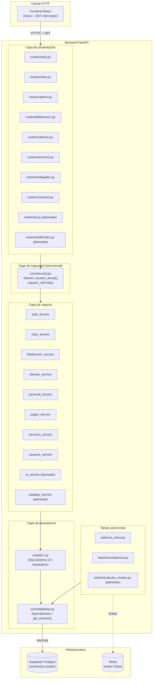
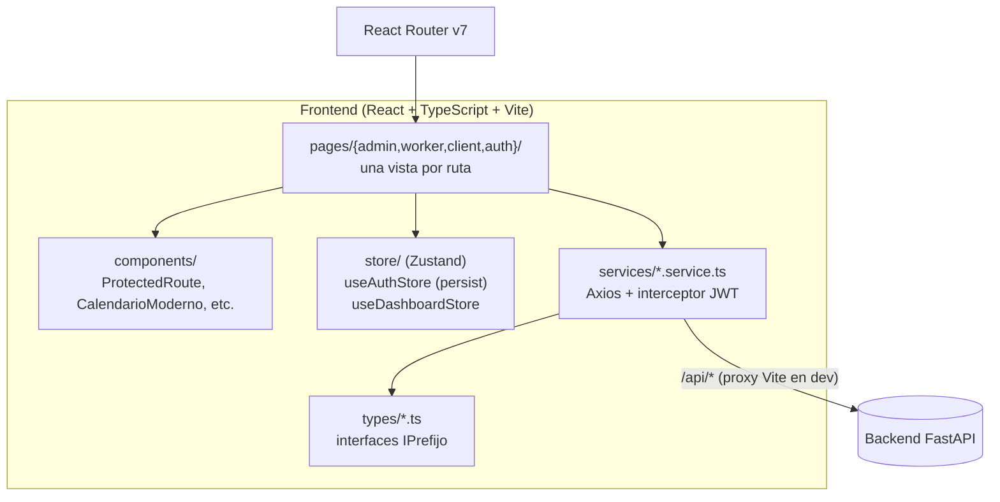

# Arquitectura del Sistema

## Vista de capas (backend)

Arquitectura en capas estricta: los routers solo enrutan, la lógica de negocio vive en
`services/`, y el acceso a datos pasa siempre por SQLAlchemy (nunca SQL crudo disperso en
services). Esta separación es la que permite que las reglas de negocio (RN01–RN18) tengan un
único lugar de verdad, independiente del transporte HTTP.

## Vista lógica del frontend

## Stack tecnológico

| Capa | Tecnología | Por qué |
|---|---|---|
| Backend | FastAPI (Python 3.12) | Async nativo, tipado con Pydantic, OpenAPI automático |
| ORM / migraciones | SQLAlchemy 2.0 (async) + Alembic | Integridad referencial real vía FKs, migraciones versionadas |
| Base de datos | Supabase Postgres (vía connection pooler / PgBouncer) | Postgres gestionado; el pooler es obligatorio en Codespaces por falta de salida IPv6 directa |
| Cola de tareas | Celery + Redis | No-show automático (RN04) y recordatorios sin bloquear el request HTTP |
| Auth | JWT (python-jose) + bcrypt | Dual: magic link (clientes) / password (staff) — ver `07_DIAGRAMAS_DE_SECUENCIA.md` |
| Notificaciones | WhatsApp Business API (Meta Cloud API) | Canal ya usado por el negocio, cero fricción de onboarding para clientas |
| Frontend | React 19 + TypeScript + Vite | SPA con Fast Refresh, build de producción con type-check integrado |
| Estado | Zustand | Más liviano que Redux para el tamaño de este dominio |
| Estilos | Tailwind CSS + variables CSS propias | Sistema de diseño con tokens (ver `docs/DESIGN.md`) |
| IA *(planeado)* | Google Gemini API (multimodal) | Análisis de imagen efímero, sin almacenamiento (ver `docs/MODULO_ASESORIA_IA.md`) |
| Pasarela *(planeado)* | Culqi | Procesador peruano, soporta Yape/Plin/tarjeta |

## Decisiones arquitectónicas clave

1. **SQLAlchemy async + `AsyncSession` por request** (`core/database.py:get_session()`): una
   sesión por request, commit automático al finalizar sin excepción, rollback si la hay —
   atomicidad por construcción sin que cada service tenga que gestionar transacciones a mano.
2. **`statement_cache_size=0` obligatorio**: PgBouncer (el pooler de Supabase, modo transacción)
   no soporta prepared statements persistentes entre requests; sin este flag, asyncpg falla
   intermitentemente bajo carga.
3. **Nunca `asyncio.gather` sobre la misma `AsyncSession`**: a diferencia del driver async de
   MongoDB (Motor) que sí toleraba queries concurrentes sobre la misma conexión, SQLAlchemy
   async no admite ejecutar más de un `session.execute(...)` a la vez sobre la misma sesión —
   todo el código de agregación (`citas_service.listar_todas_con_nombres`, `enriquecer_cita`)
   ejecuta sus queries secuencialmente por diseño, no por descuido.
4. **Auth dual con un único esquema de JWT**: el payload (`sub`, `rol`, `nombre`, `exp`) es
   idéntico para clientes y staff — la diferencia está en cómo se obtiene el token (magic link
   vs. login con contraseña), no en su estructura, lo que simplifica `core/security.py` a una
   sola función de verificación para los tres roles.
5. **Celery worker separado del proceso web**: `tasks/db.py` crea su sessionmaker de forma
   perezoza (tras el fork de los workers prefork de Celery), nunca a import-time — compartir un
   pool de conexiones asyncpg creado antes del fork produciría conexiones corruptas entre
   procesos hijos.
6. **Enums Python mapeados a `VARCHAR` + `CHECK`, no `ENUM` nativo de Postgres**
   (`models/enums.py`): un `CHECK` se autogenera y evoluciona con Alembic como cualquier otro
   constraint; un `ALTER TYPE ... ADD VALUE` nativo de Postgres es más rígido y Alembic no lo
   detecta en `--autogenerate`.
