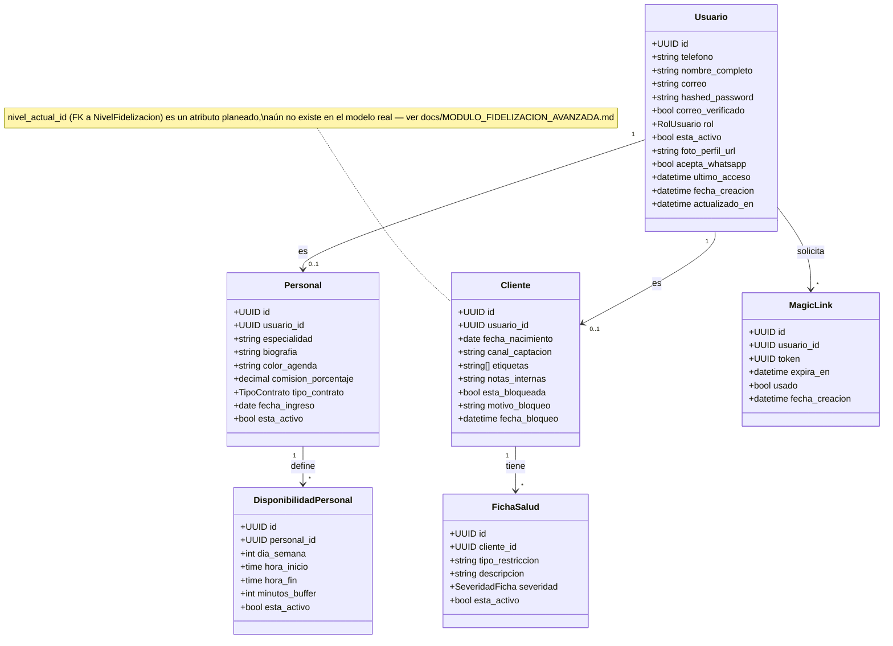
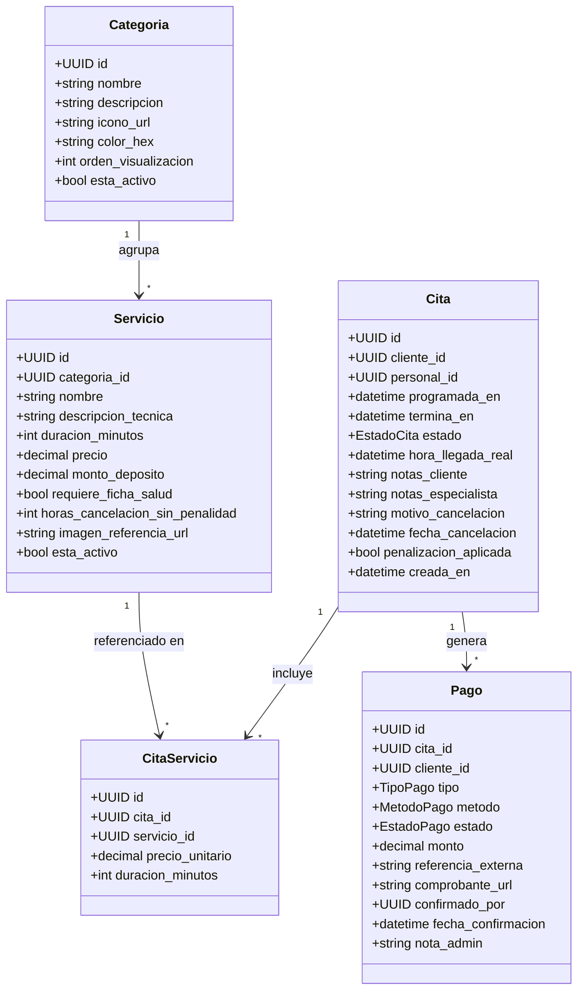
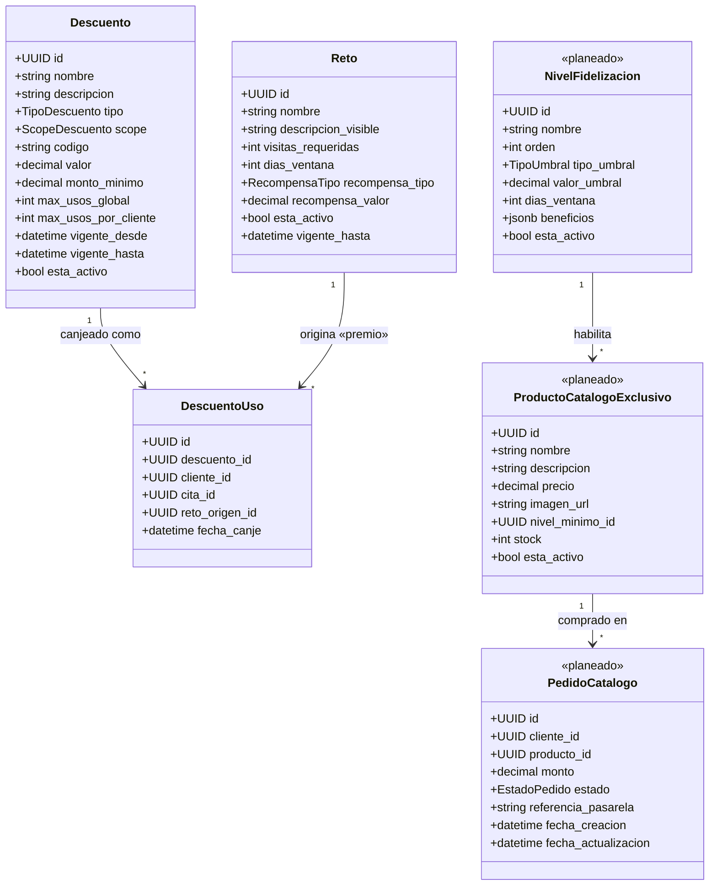
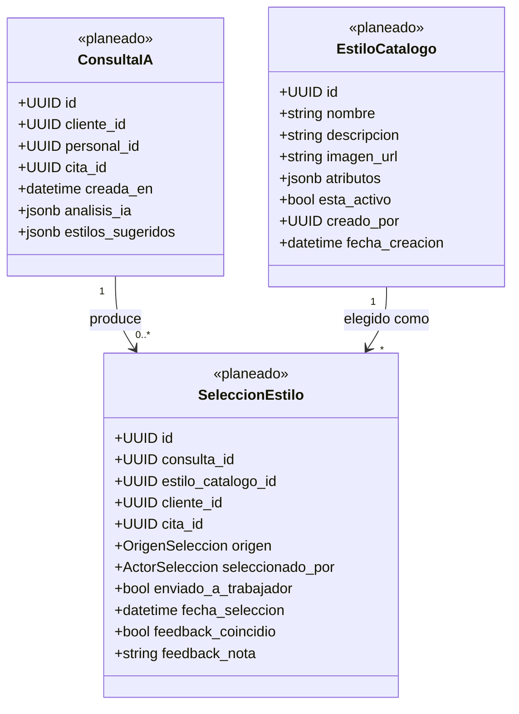
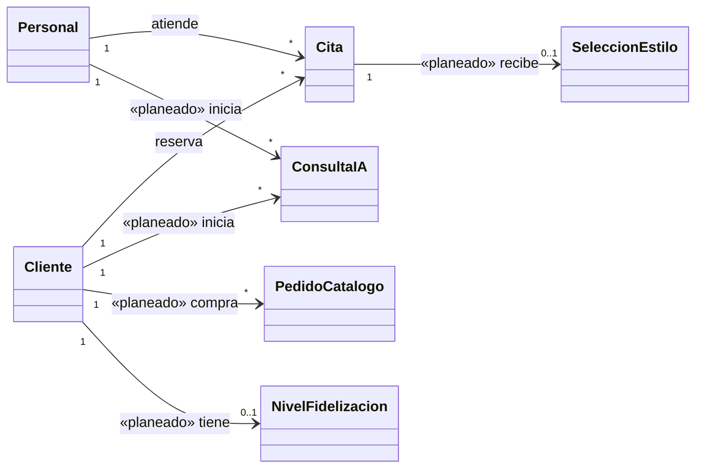

# Diagrama de Clases

Modelo de dominio completo. Las clases con el estereotipo `<<planeado>>` corresponden a
`docs/MODULO_ASESORIA_IA.md` y `docs/MODULO_FIDELIZACION_AVANZADA.md` — no tienen código en
`backend/app/models/` todavía. El resto refleja exactamente los modelos SQLAlchemy reales.

## Núcleo: identidad, personal y clientes

## Catálogo de servicios, citas y pagos

## Fidelización (actual + planeada)

## Asesoría de belleza con IA (planeada)

## Relaciones entre subdominios (resumen)

