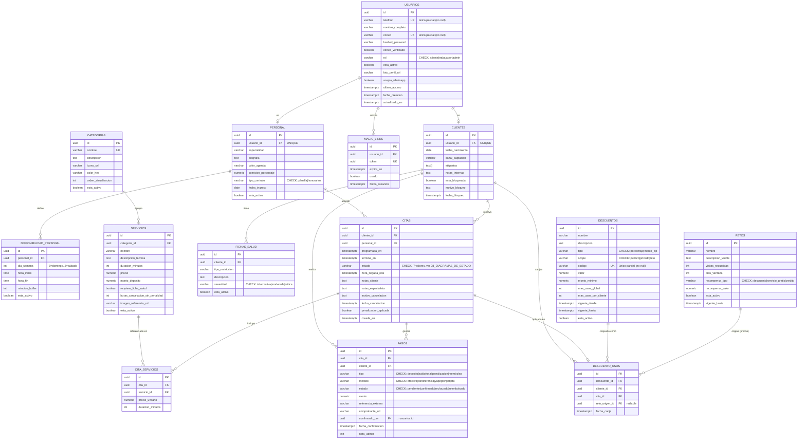
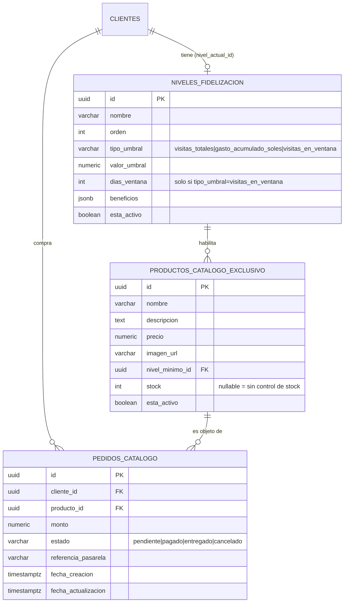
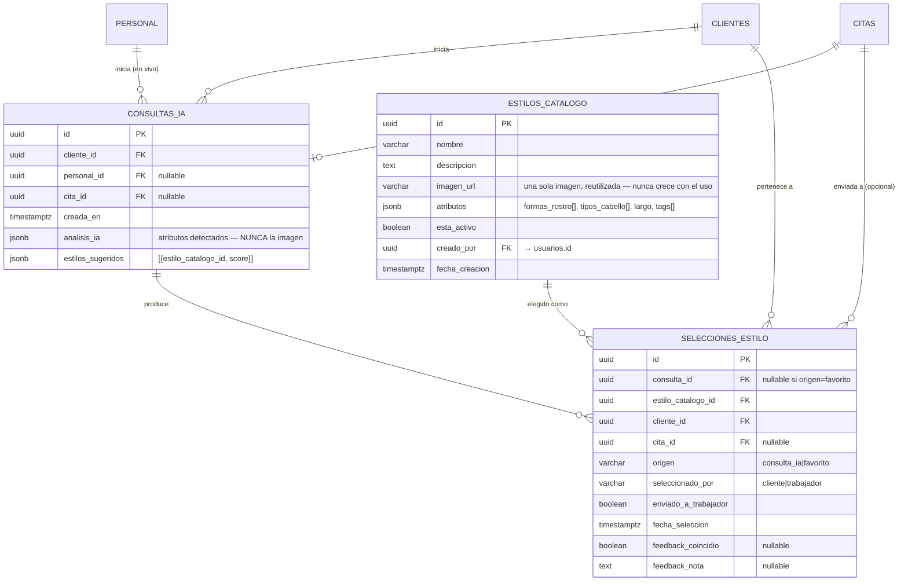

# Modelo Entidad-Relación

Nombres de tabla y columnas exactamente como en la migración real de Alembic
(`backend/alembic/versions/b1b681b3a2a7_esquema_inicial.py`) para las 14 tablas implementadas.
Las tablas planeadas usan la misma convención de nombres (`snake_case`, plural) que tendrían al
generarse su propia migración.

## Esquema implementado (14 tablas)

**Restricción compuesta relevante**: `descuento_usos` tiene `UNIQUE(descuento_id, cliente_id,
cita_id)` — es lo que hace atómica la validación de RN14 bajo `SELECT ... FOR UPDATE`.

## Esquema planeado — Fidelización avanzada

## Esquema planeado — Asesoría de belleza con IA

**Garantía de esquema (RN17)**: ninguna de las tres tablas de este bloque tiene una columna de
tipo imagen/blob para la foto de la clienta — la única columna de imagen del bloque completo es
`estilos_catalogo.imagen_url`, que es una imagen de referencia del catálogo, no de una clienta.
