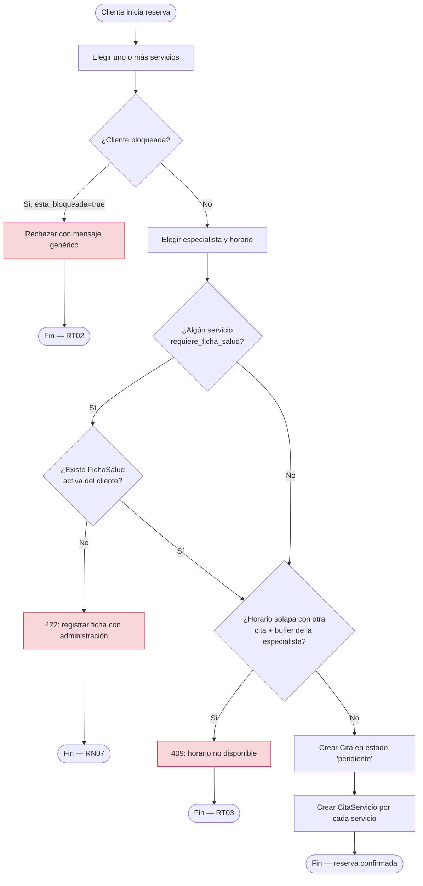
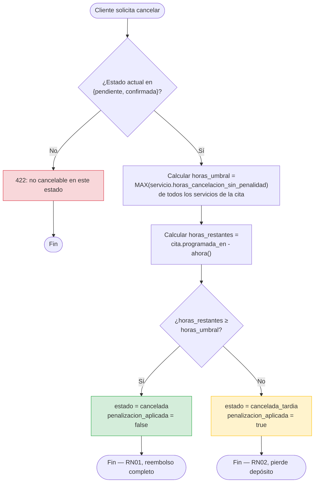
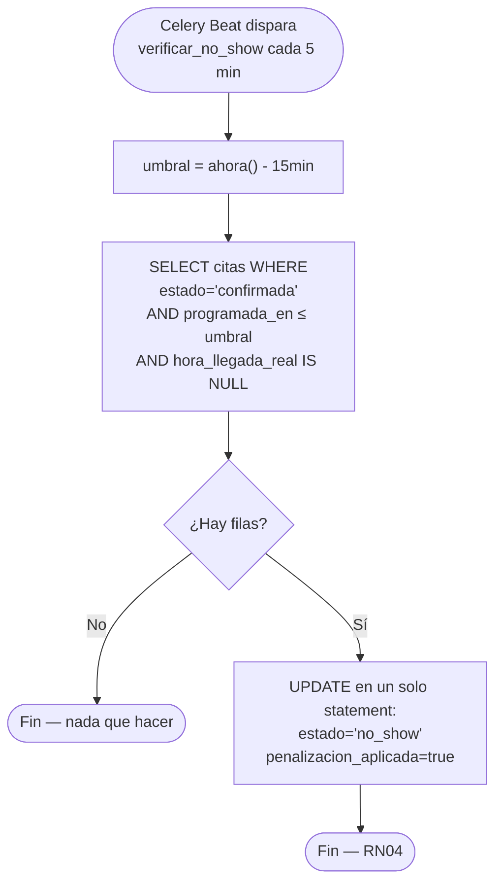
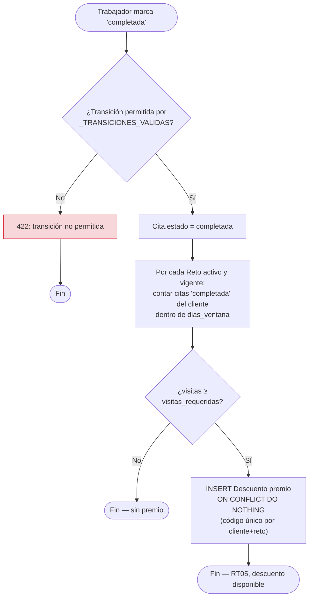
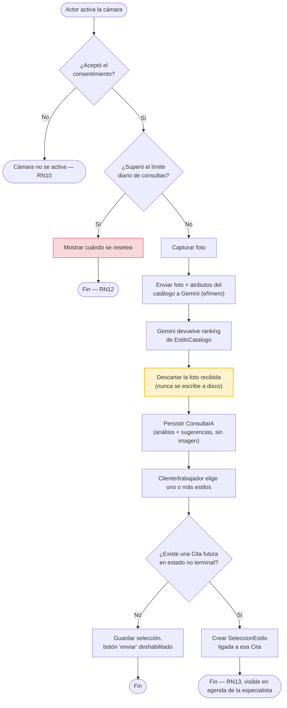
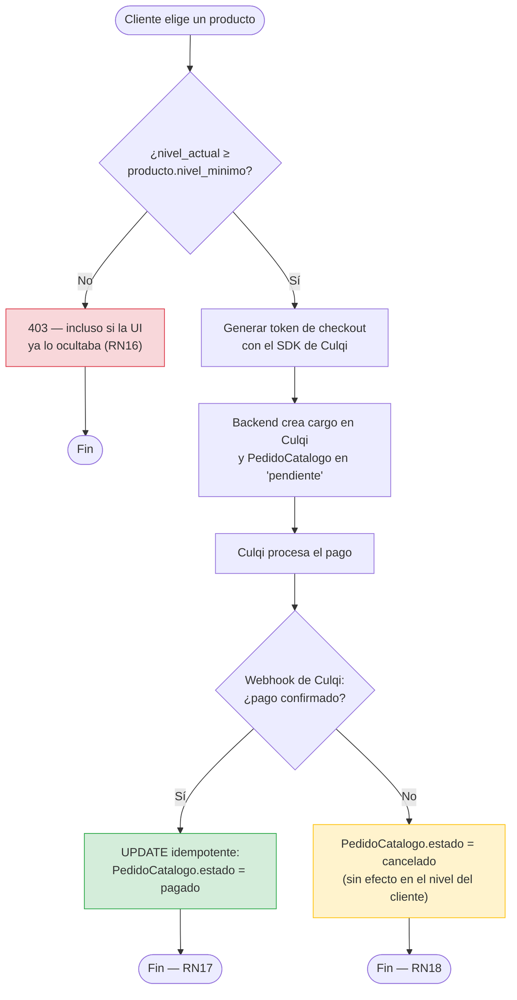

# Diagramas de Actividad

Mermaid no soporta carriles (swimlanes) nativos en `flowchart`; se aproximan con `subgraph` por
actor/componente cuando aporta claridad, y con nodos de decisión (`{...}`) para las reglas de
negocio. Cada diagrama corresponde a uno o más casos de uso de `02_CASOS_DE_USO_UML.md`.

## Reservar una cita (CUS03)

## Cancelar una cita (CUS08)

## No-show automático (RN04 — disparado por Celery Beat)

## Completar una cita y verificar retos (CUS11 → CUS09)

## Consulta de asesoría con IA *(planeado, CUS22/CUS26)*

## Compra en el catálogo exclusivo *(planeado, CUS25)*

