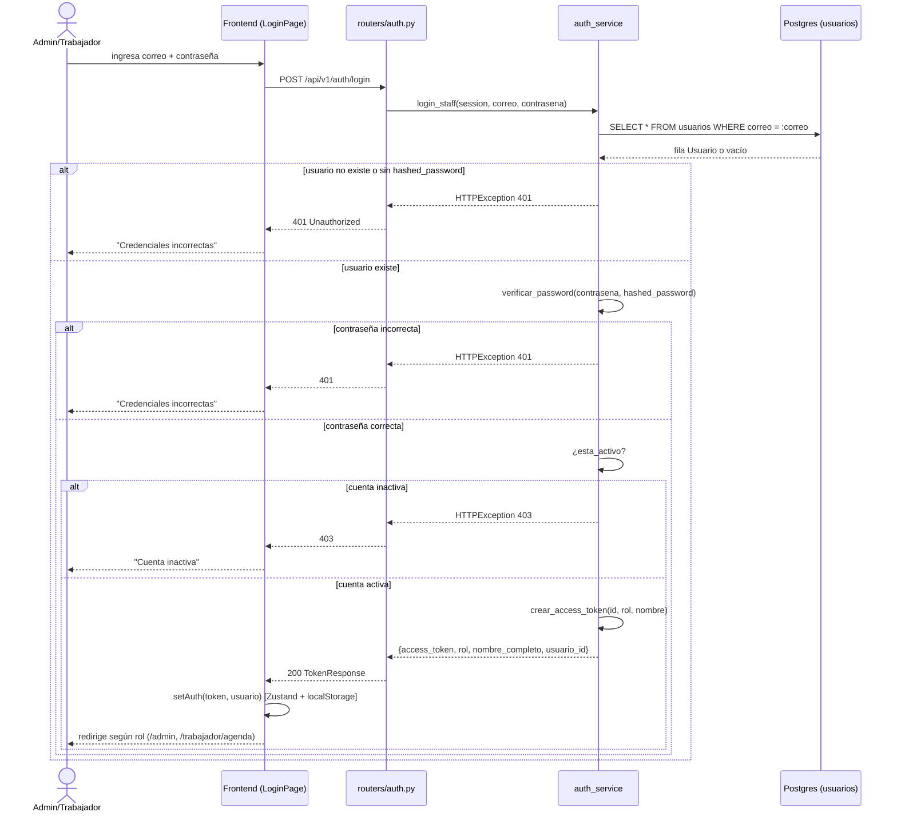
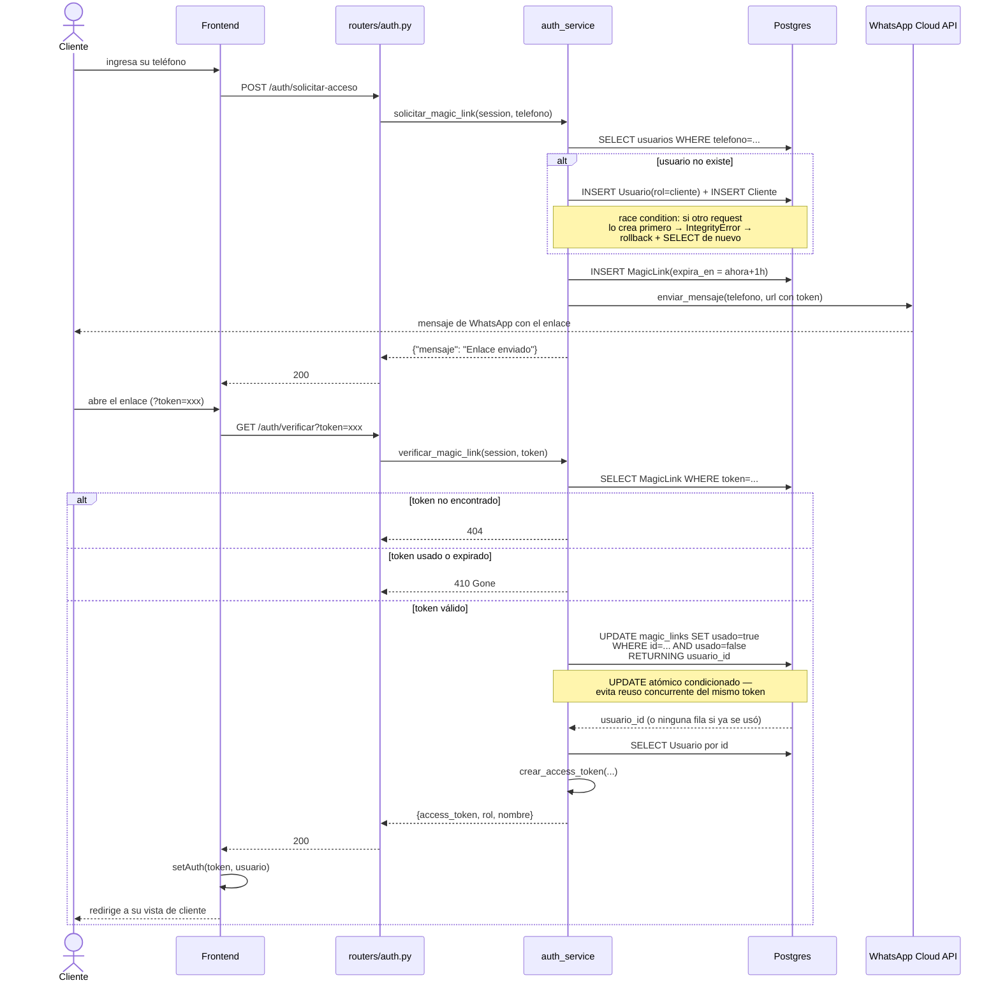
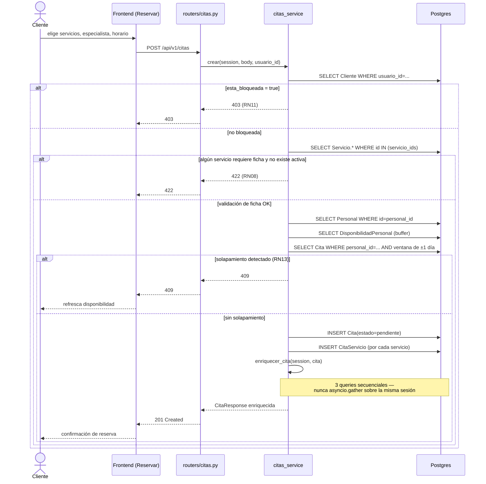
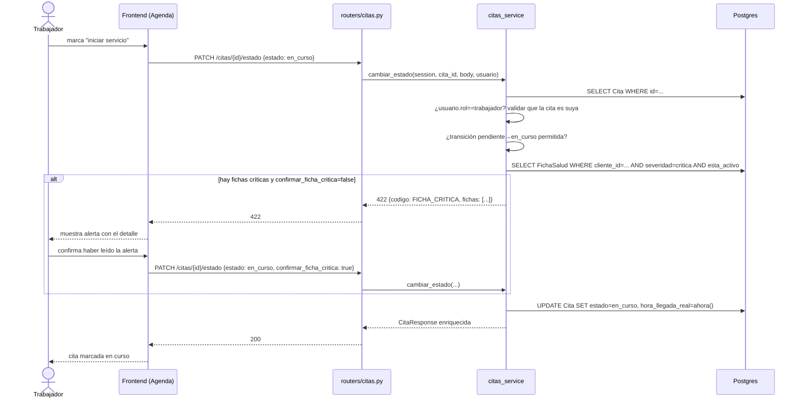
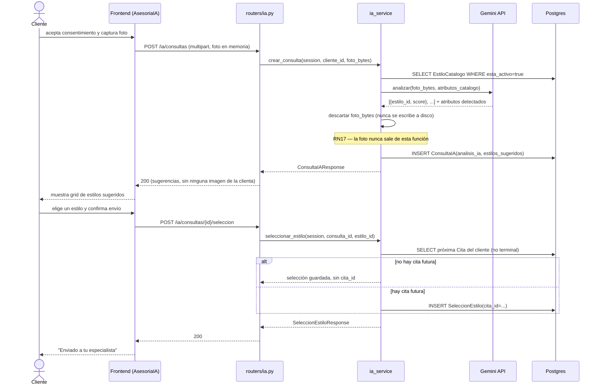
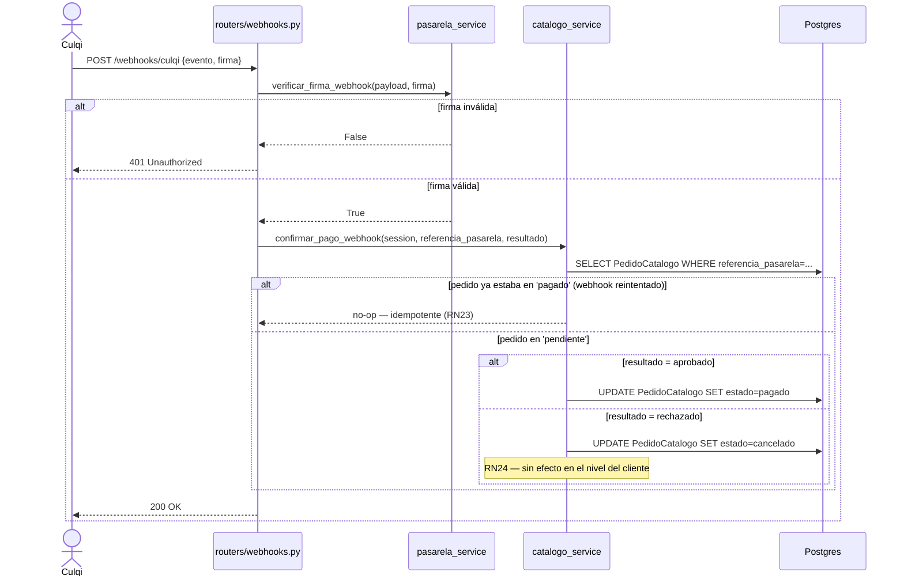

# Diagramas de Secuencia

Interacción temporal actor → frontend → router → service → base de datos (y actor secundario
cuando aplica) para los flujos más representativos de cada capa de la arquitectura.

## Login de staff (email + contraseña)

## Flujo completo de magic link (cliente)

## Crear una cita (con validaciones RN08/RN11/RN13)

## Cambiar estado de cita con alerta de ficha crítica (RN09)

## Consulta de asesoría con IA *(planeado)*

## Webhook de confirmación de pago (Culqi) *(planeado)*

