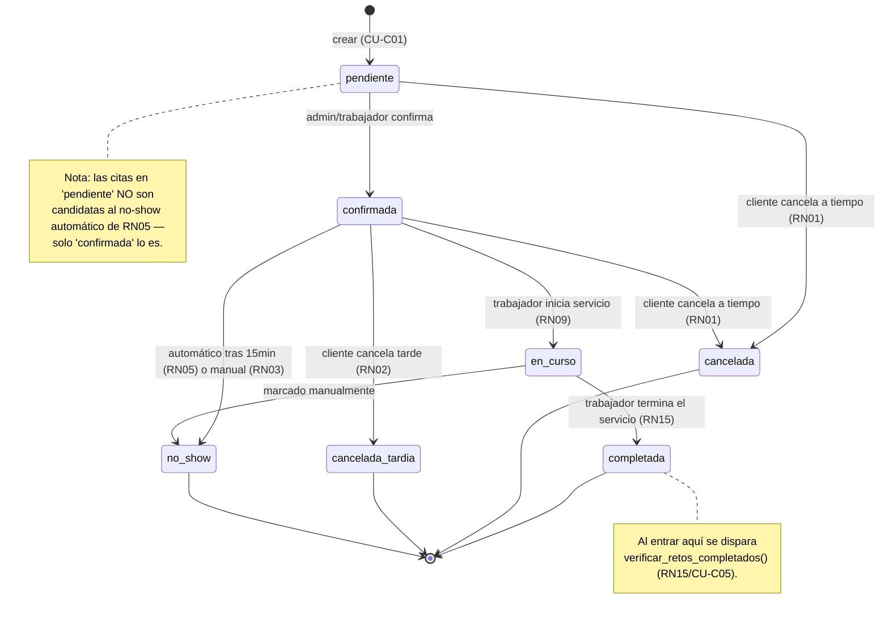
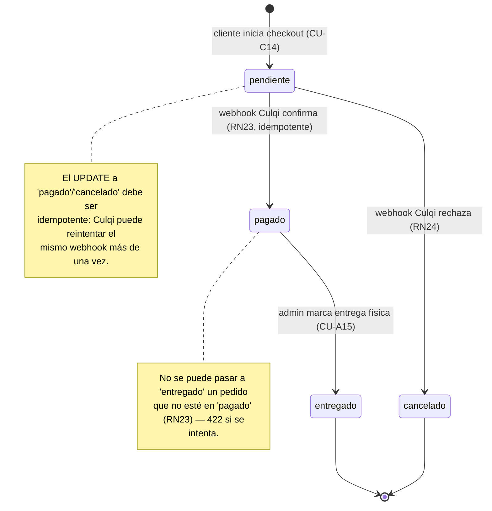
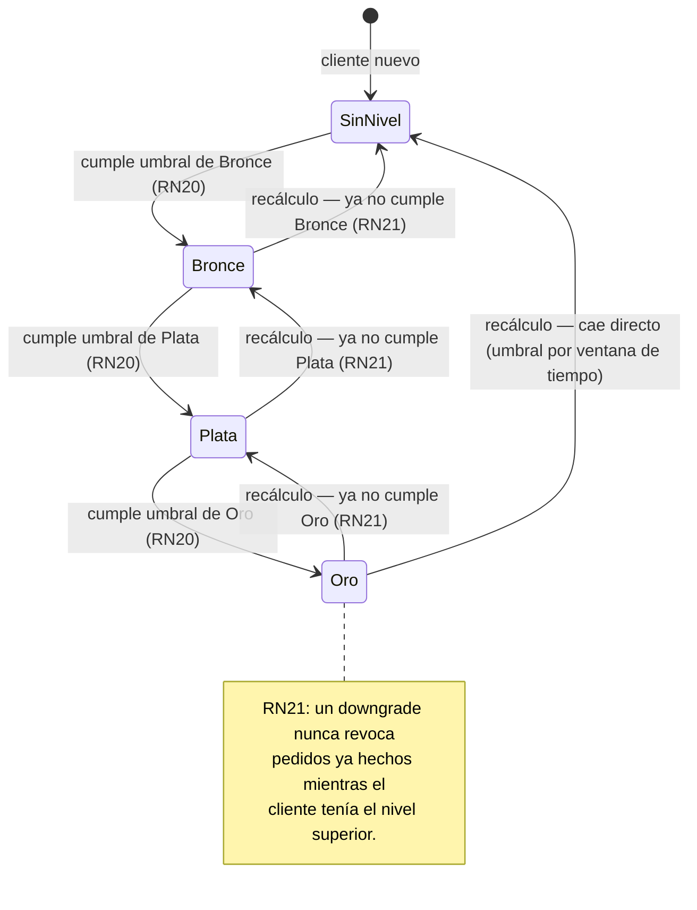

# Diagramas de Estado

## Ciclo de vida de `Cita`

Reflejo exacto de `_TRANSICIONES_VALIDAS` en `backend/app/services/citas_service.py:20` —
cualquier cambio a este diagrama debe reflejarse primero en ese diccionario, es la única fuente
de verdad en código.

Estados terminales (`completada`, `cancelada`, `cancelada_tardia`, `no_show`): ninguno tiene
transición de salida — una vez ahí, la cita es inmutable en cuanto a estado (`_ESTADOS_
BLOQUEADOS` en el código, usado también para excluir estas citas del cálculo de solapamiento de
RN13).

## Ciclo de vida de `PedidoCatalogo` *(planeado)*

## Nivel de fidelización de un cliente *(planeado, ilustrativo)*

Los niveles no son fijos en el diseño — el admin los configura (nombre, orden, umbral, ver
`docs/MODULO_FIDELIZACION_AVANZADA.md`). Este diagrama ilustra la dinámica con un ejemplo de
tres niveles (Bronce/Plata/Oro); en producción puede haber cualquier cantidad configurada.

