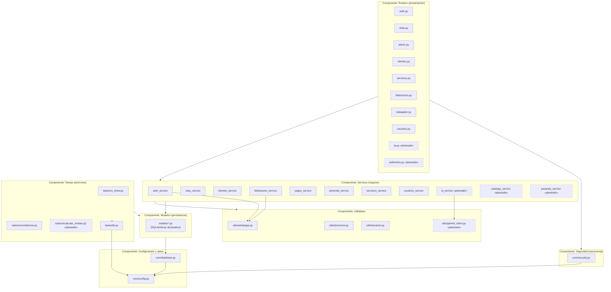
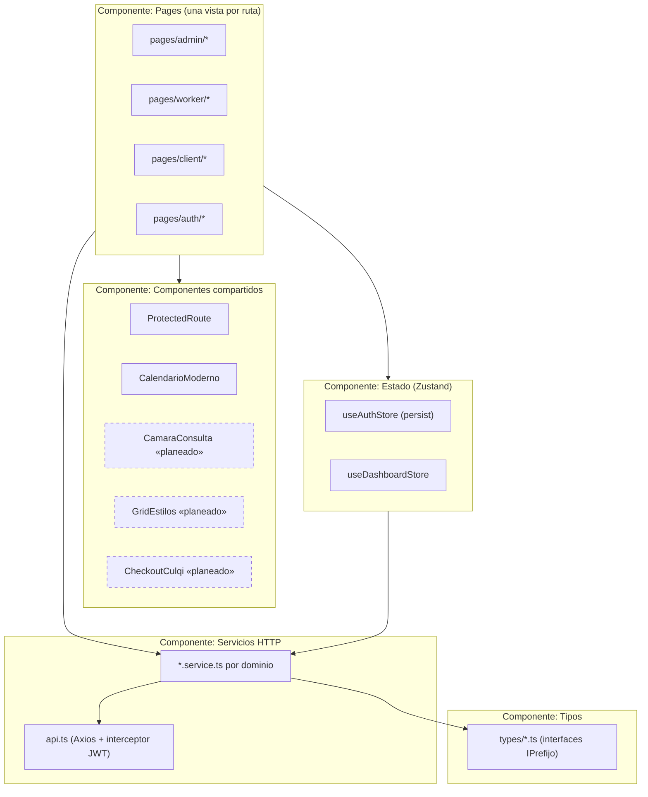

# Diagrama de Componentes

Componentes de software y sus dependencias de compilación/import — no confundir con el
diagrama de despliegue (`10_DIAGRAMA_DE_DESPLIEGUE.md`), que es sobre nodos físicos.

## Backend (`backend/app/`)

## Frontend (`frontend/src/`)

## Interfaces expuestas entre componentes (contrato)

| Componente proveedor | Interfaz | Componente consumidor |
|---|---|---|
| `core/security.py` | `obtener_usuario_actual()`, `requerir_rol(*roles)` (dependencias FastAPI) | todos los `routers/*.py` |
| `core/database.py` | `get_session()` (dependencia FastAPI, `AsyncSession`) | todos los `routers/*.py` vía `Depends` |
| `services/*.py` | funciones async puras (reciben `session` como primer parámetro) | `routers/*.py` |
| `models/*.py` | clases SQLAlchemy declarativas | `services/*.py`, `alembic/env.py` |
| `services/api.ts` | instancia Axios configurada | todo `services/*.service.ts` del frontend |
| `store/useAuthStore.ts` | `token`, `usuario`, `setAuth()`, `cerrarSesion()` | `ProtectedRoute`, todas las `pages/*` |
