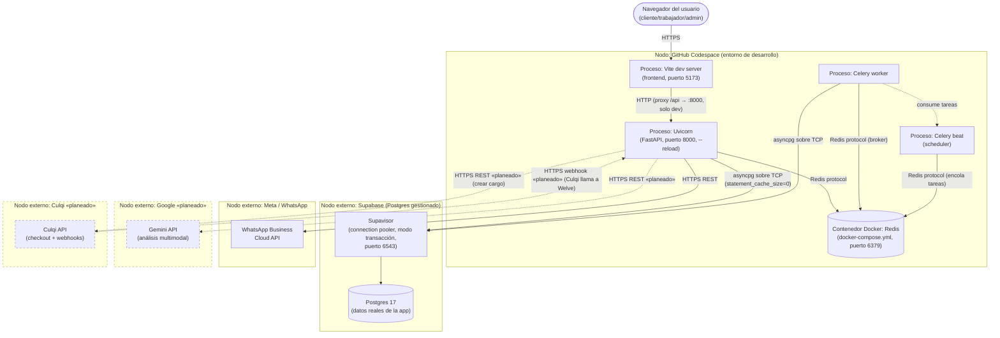

# Diagrama de Despliegue

Nodos físicos/lógicos de infraestructura y el protocolo de comunicación entre ellos, para el
entorno de desarrollo actual (GitHub Codespaces) — la topología de producción real (fuera de
Codespaces) es la misma salvo por dónde corren el proceso web y el worker de Celery, que en
producción irían en su propio contenedor/servidor en vez de convivir en la misma máquina de
desarrollo.

## Notas de despliegue

- **Por qué el pooler y no conexión directa**: Supabase resuelve por defecto solo IPv6 en la
  conexión directa (`db.<project_ref>.supabase.co:5432`), que falla en Codespaces (sin salida
  IPv6). El pooler (`aws-0-<region>.pooler.supabase.com:6543`) sí resuelve IPv4.
- **`statement_cache_size=0` es obligatorio** en cualquier conexión que pase por el pooler en
  modo transacción (PgBouncer) — sin este flag, asyncpg intenta reutilizar prepared statements
  entre requests que PgBouncer no garantiza que vuelvan a la misma conexión física de Postgres.
- **Worker y Beat como procesos separados del proceso web**: permite que una tarea larga (o un
  reintento de WhatsApp) no bloquee el hilo de eventos de FastAPI — se comunican solo a través
  de Redis como broker, nunca por llamada directa de función entre procesos.
- **El único actor secundario que abre una conexión *hacia* Welve** es Culqi (webhook) — todos
  los demás (WhatsApp, Gemini) son invocados por Welve, nunca al revés. Esto es relevant para el
  diseño de seguridad: el endpoint del webhook no puede depender de JWT de sesión (no hay
  usuario logueado del lado de Culqi) y debe validarse por firma criptográfica del payload.
- **Frontend en producción**: el proxy `/api` de Vite es solo de desarrollo (`vite.config.ts`);
  en un build de producción, `VITE_API_URL` apunta directo a la URL pública del backend — no hay
  proxy intermedio.
