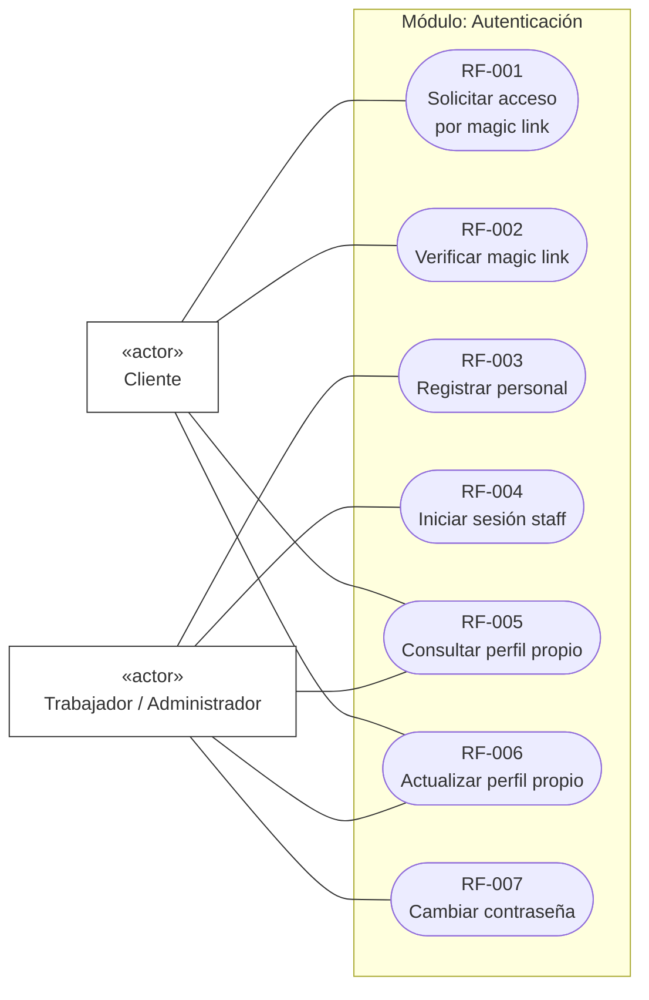
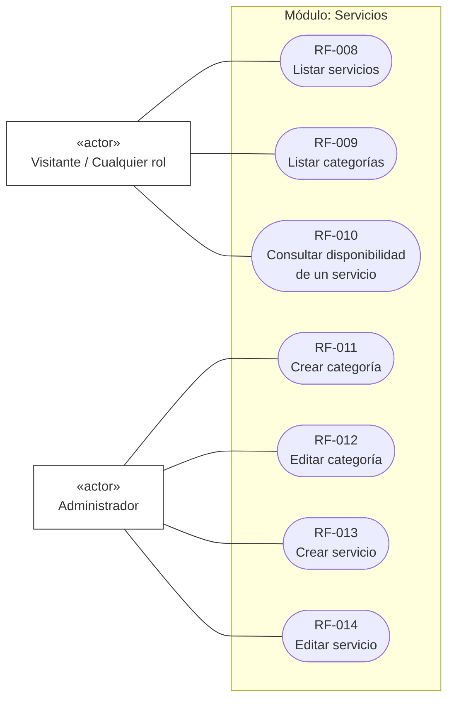
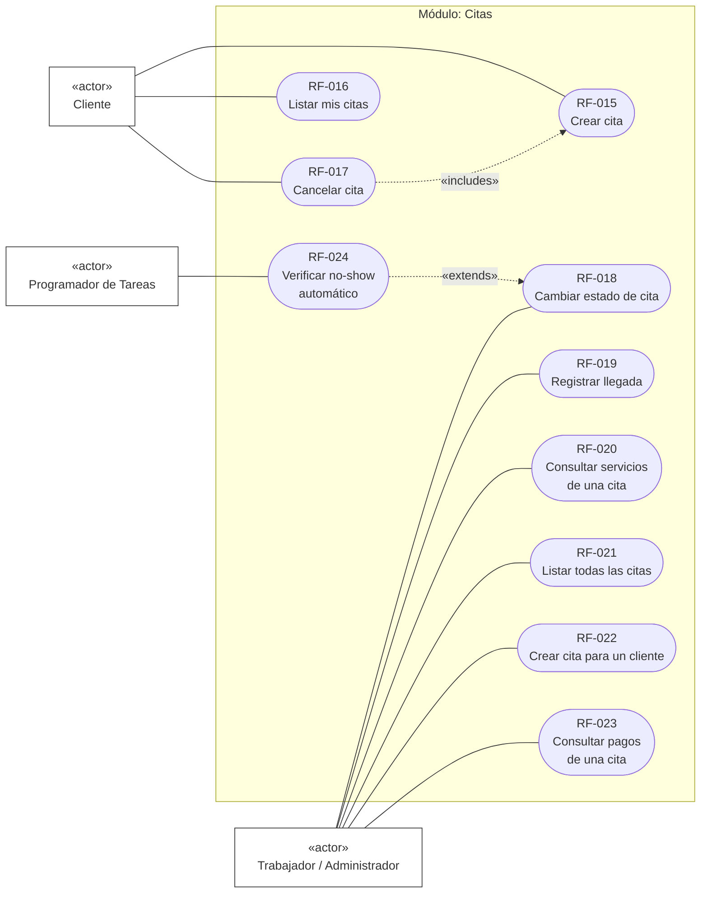
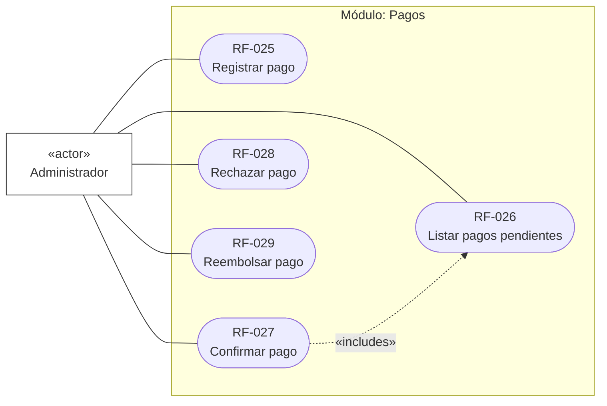
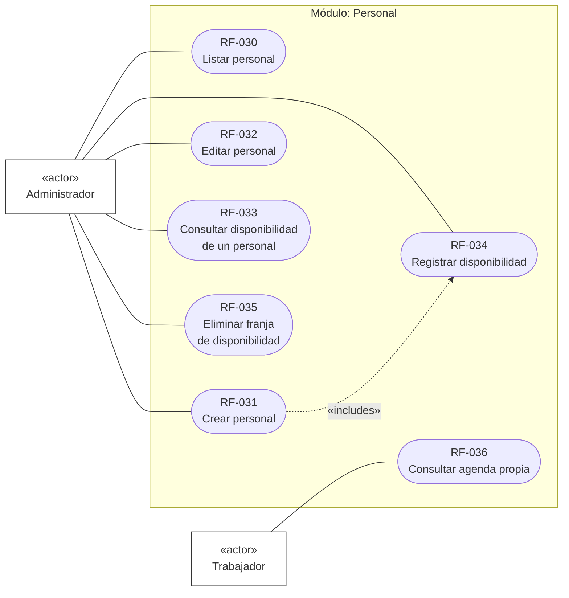
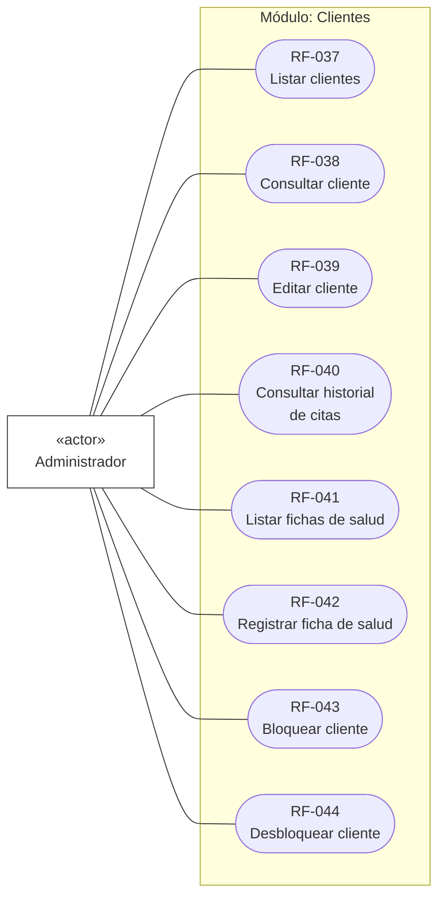
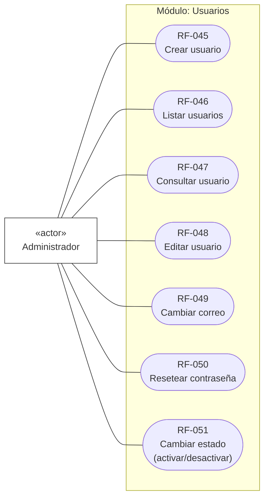
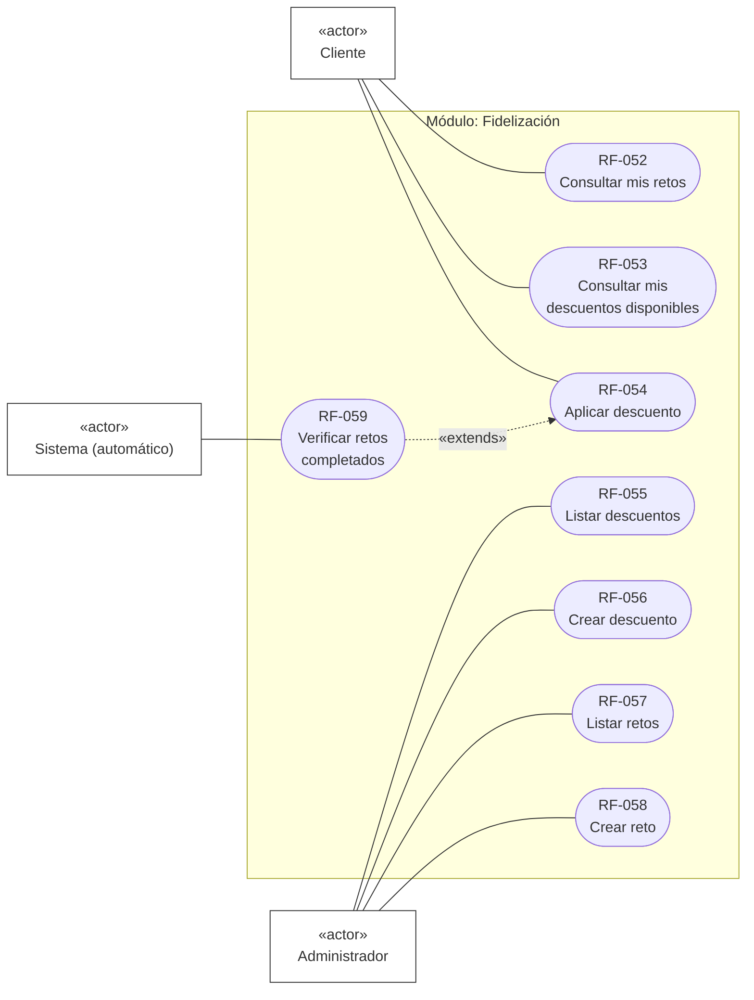
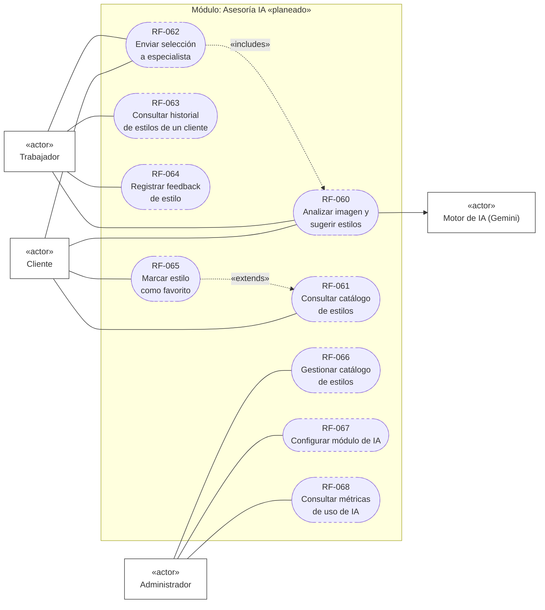
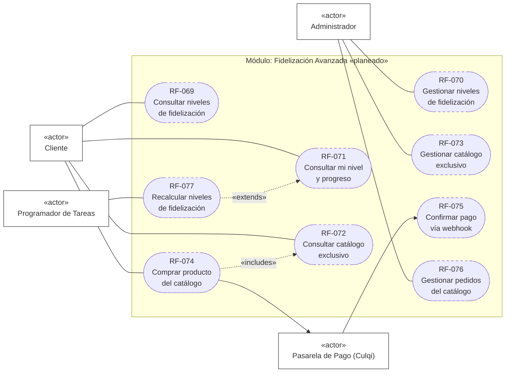

# Requerimientos Funcionales

Especificación completa de requerimientos funcionales (RF), organizada por módulo del sistema
— formato estándar de especificación de requerimientos de software (ERS): código, nombre,
descripción (entrada → proceso → salida), actor(es), prioridad, caso de uso relacionado y regla
de negocio asociada. **77 requerimientos funcionales en total**: 59 implementados, 18 planeados
(ver el resumen cuantitativo al final del documento).

Cada módulo trae su propio diagrama de casos de uso (notación UML formal — actor como
rectángulo `«actor»`, requerimiento como elipse) para que ningún RF quede sin representación
gráfica, tal como exige una especificación profesional completa.

Prioridad: **Alta** (crítico para la operación diaria), **Media** (valor claro, no bloqueante),
**Baja** (mejora incremental). Los RF planeados se marcan `«planeado»` y remiten a
`docs/MODULO_ASESORIA_IA.md` / `docs/MODULO_FIDELIZACION_AVANZADA.md`.

---

## Módulo 1 — Autenticación

| Código | Nombre | Descripción | Actor(es) | Prioridad | CU | RN |
|---|---|---|---|---|---|---|
| RF-001 | Solicitar acceso por magic link | Entrada: teléfono. Proceso: busca o crea `Usuario`+`Cliente`, genera `MagicLink` (TTL 1h), envía enlace por WhatsApp si `acepta_whatsapp=true`. Salida: confirmación de envío. | Cliente | Alta | — | — |
| RF-002 | Verificar magic link | Entrada: token UUID. Proceso: valida no usado/no expirado, `UPDATE` atómico `usado=true`, emite JWT. Salida: `access_token`, rol, nombre. | Cliente | Alta | — | — |
| RF-003 | Registrar personal (staff) | Entrada: nombre, correo, contraseña, rol (`admin`\|`trabajador`). Proceso: valida correo único, hashea contraseña, crea `Usuario`. Salida: JWT. | Admin/Trabajador (auto-registro) | Media | — | — |
| RF-004 | Iniciar sesión staff | Entrada: correo, contraseña. Proceso: valida credenciales y `esta_activo`. Salida: JWT. | Trabajador, Admin | Alta | — | — |
| RF-005 | Consultar perfil propio | Entrada: JWT. Salida: datos del `Usuario` autenticado. | Cliente, Trabajador, Admin | Media | — | — |
| RF-006 | Actualizar perfil propio | Entrada: nombre/correo/teléfono (parciales). Proceso: valida unicidad de correo/teléfono. Salida: perfil actualizado. | Cliente, Trabajador, Admin | Media | — | — |
| RF-007 | Cambiar contraseña | Entrada: contraseña actual + nueva (≥8 caracteres). Proceso: valida actual, hashea nueva. Salida: confirmación. | Trabajador, Admin | Baja | — | — |

---

## Módulo 2 — Gestión de Servicios y Categorías

| Código | Nombre | Descripción | Actor(es) | Prioridad | CU | RN |
|---|---|---|---|---|---|---|
| RF-008 | Listar servicios | Salida: catálogo de `Servicio` activos, sin autenticación. | Público | Alta | CU-C01 | — |
| RF-009 | Listar categorías | Salida: `Categoria` ordenadas por `orden_visualizacion`. | Público | Media | CU-C01 | — |
| RF-010 | Consultar disponibilidad de un servicio | Entrada: `servicio_id`. Salida: horarios libres considerando duración, buffer y citas existentes. | Público | Alta | CU-C01 | RN13 |
| RF-011 | Crear categoría | Entrada: nombre, ícono, color, orden. Salida: `Categoria` creada. | Admin | Media | CU-A01 | — |
| RF-012 | Editar categoría | Entrada: campos parciales. Salida: `Categoria` actualizada. | Admin | Baja | CU-A01 | — |
| RF-013 | Crear servicio | Entrada: nombre, duración, precio, depósito, `requiere_ficha_salud`, `horas_cancelacion_sin_penalidad`. Salida: `Servicio` creado. | Admin | Alta | CU-A01 | RN01, RN02, RN08 |
| RF-014 | Editar servicio | Entrada: campos parciales. Salida: `Servicio` actualizado. | Admin | Media | CU-A01 | — |

---

## Módulo 3 — Gestión de Citas

| Código | Nombre | Descripción | Actor(es) | Prioridad | CU | RN |
|---|---|---|---|---|---|---|
| RF-015 | Crear cita | Entrada: servicios, especialista, horario, notas. Proceso: valida bloqueo, ficha de salud, solapamiento. Salida: `Cita` en `pendiente`. | Cliente | Alta | CU-C01 | RN08, RN11, RN13 |
| RF-016 | Listar mis citas | Salida: citas del cliente autenticado, ordenadas por fecha descendente. | Cliente | Alta | CU-C01 | — |
| RF-017 | Cancelar cita | Entrada: motivo opcional. Proceso: calcula horas restantes vs. umbral del servicio. Salida: `cancelada` o `cancelada_tardia`. | Cliente | Alta | CU-C02, CU-C03 | RN01, RN02 |
| RF-018 | Cambiar estado de cita | Entrada: nuevo estado, `confirmar_ficha_critica` opcional. Proceso: valida transición y ficha crítica. Salida: `Cita` actualizada. | Trabajador, Admin | Alta | CU-T02, CU-T03 | RN09, RN15 |
| RF-019 | Registrar llegada | Entrada: hora de llegada. Salida: `hora_llegada_real` registrada, sin cambiar estado. | Trabajador, Admin | Media | CU-T02 | — |
| RF-020 | Consultar servicios de una cita | Salida: lista de `CitaServicio` con precio y duración congelados al momento de la reserva. | Trabajador, Admin | Baja | — | — |
| RF-021 | Listar todas las citas | Entrada: filtros opcionales (fecha, estado). Salida: citas enriquecidas con nombres de cliente/especialista/servicio. | Admin | Alta | CU-A06 | — |
| RF-022 | Crear cita para un cliente | Igual que RF-015 pero iniciado por el admin en nombre de un cliente, sin restricción de anticipación mínima. | Admin | Media | CU-A01 | RN13 |
| RF-023 | Consultar pagos de una cita | Salida: historial de `Pago` asociados a la cita. | Admin | Media | CU-A02 | — |
| RF-024 | Verificar no-show automático | Proceso batch (cada 5 min): marca `no_show` las citas `confirmada` con 15+ min de retraso sin llegada registrada. | Sistema (Celery Beat) | Alta | — | RN05 |

---

## Módulo 4 — Gestión de Pagos

| Código | Nombre | Descripción | Actor(es) | Prioridad | CU | RN |
|---|---|---|---|---|---|---|
| RF-025 | Registrar pago | Entrada: cita, tipo, método, monto. Salida: `Pago` en `pendiente`. | Admin | Alta | CU-A02 | — |
| RF-026 | Listar pagos pendientes | Salida: `Pago` con `estado=pendiente`, para conciliación diaria. | Admin | Alta | CU-A06 | — |
| RF-027 | Confirmar pago | Proceso: registra `confirmado_por` y `fecha_confirmacion`. Salida: `Pago.estado=confirmado`. | Admin | Alta | CU-A02 | — |
| RF-028 | Rechazar pago | Salida: `Pago.estado=rechazado`. | Admin | Media | CU-A02 | — |
| RF-029 | Reembolsar pago | Salida: `Pago.estado=reembolsado` (proceso manual, sin integración automática). | Admin | Media | CU-A02 | RN01 |

---

## Módulo 5 — Gestión de Personal

| Código | Nombre | Descripción | Actor(es) | Prioridad | CU | RN |
|---|---|---|---|---|---|---|
| RF-030 | Listar personal | Salida: especialistas con especialidad, comisión, estado. | Admin | Media | CU-A01 | — |
| RF-031 | Crear personal | Entrada: `usuario_id` (creado previamente como `Usuario` rol `trabajador`), especialidad, comisión, tipo de contrato. Salida: `Personal` creado. | Admin | Alta | CU-A01 | — |
| RF-032 | Editar personal | Entrada: campos parciales. Salida: `Personal` actualizado. | Admin | Media | CU-A01 | — |
| RF-033 | Consultar disponibilidad de un personal | Salida: franjas semanales (`DisponibilidadPersonal`). | Admin | Media | CU-A01 | RN13 |
| RF-034 | Registrar disponibilidad | Entrada: día, hora inicio/fin, buffer. Salida: franja creada. | Admin | Alta | CU-A01 | RN13 |
| RF-035 | Eliminar franja de disponibilidad | Salida: franja eliminada/desactivada. | Admin | Baja | CU-A01 | — |
| RF-036 | Consultar agenda propia | Salida: citas del día de la especialista autenticada, sin datos financieros ni de otras especialistas. | Trabajador | Alta | CU-T01 | — |

---

## Módulo 6 — Gestión de Clientes

| Código | Nombre | Descripción | Actor(es) | Prioridad | CU | RN |
|---|---|---|---|---|---|---|
| RF-037 | Listar clientes | Salida: clientes con etiquetas, estado de bloqueo. | Admin | Media | CU-A01 | — |
| RF-038 | Consultar cliente | Salida: perfil completo de un `Cliente`. | Admin | Media | — | — |
| RF-039 | Editar cliente | Entrada: etiquetas, notas internas (nunca `correo`/`password`, rechazados explícitamente). Salida: `Cliente` actualizado. | Admin | Media | — | — |
| RF-040 | Consultar historial de citas | Salida: lista de `Cita` pasadas del cliente. | Admin | Media | — | — |
| RF-041 | Listar fichas de salud | Salida: `FichaSalud` del cliente, con severidad. | Admin | Alta | CU-T03 | RN08, RN09 |
| RF-042 | Registrar ficha de salud | Entrada: tipo de restricción, descripción, severidad. Salida: `FichaSalud` creada. | Admin | Alta | CU-T03 | RN08, RN09 |
| RF-043 | Bloquear cliente | Entrada: motivo. Salida: `esta_bloqueada=true`, `fecha_bloqueo` registrada. | Admin | Media | — | RN11 |
| RF-044 | Desbloquear cliente | Salida: `esta_bloqueada=false`. | Admin | Baja | — | RN11 |

---

## Módulo 7 — Administración de Usuarios

| Código | Nombre | Descripción | Actor(es) | Prioridad | CU | RN |
|---|---|---|---|---|---|---|
| RF-045 | Crear usuario | Entrada: nombre, rol, correo/teléfono según rol. Proceso: si `rol=cliente`, crea también el `Cliente` vinculado automáticamente. Salida: `Usuario` creado. | Admin | Alta | CU-A01 | — |
| RF-046 | Listar usuarios | Entrada: filtros `rol`, `esta_activo`. Salida: lista de usuarios. | Admin | Media | — | — |
| RF-047 | Consultar usuario | Salida: detalle de un `Usuario`. | Admin | Baja | — | — |
| RF-048 | Editar usuario | Entrada: nombre, teléfono, `esta_activo`. Salida: `Usuario` actualizado. | Admin | Media | — | — |
| RF-049 | Cambiar correo | Entrada: nuevo correo. Proceso: resetea `correo_verificado=false`. Salida: correo actualizado. | Admin | Baja | — | — |
| RF-050 | Resetear contraseña | Entrada: nueva contraseña. Salida: 204 (sin contenido). | Admin | Media | — | — |
| RF-051 | Cambiar estado de usuario | Salida: `esta_activo` alternado. | Admin | Media | — | — |

---

## Módulo 8 — Fidelización (implementado)

| Código | Nombre | Descripción | Actor(es) | Prioridad | CU | RN |
|---|---|---|---|---|---|---|
| RF-052 | Consultar mis retos | Salida: progreso de cada `Reto` activo (visitas completadas / requeridas). | Cliente | Media | CU-C05 | RN15 |
| RF-053 | Consultar mis descuentos disponibles | Salida: `Descuento` vigentes que el cliente aún puede canjear. | Cliente | Media | CU-C04 | RN14 |
| RF-054 | Aplicar descuento | Entrada: código, cita. Proceso: bloqueo optimista, valida vigencia y límites de uso. Salida: `DescuentoUso` registrado. | Cliente | Alta | CU-C04 | RN14 |
| RF-055 | Listar descuentos | Salida: todos los `Descuento` (admin). | Admin | Baja | CU-A03 | — |
| RF-056 | Crear descuento | Entrada: tipo, scope, código, valor, límites, vigencia. Salida: `Descuento` creado. | Admin | Media | CU-A03 | — |
| RF-057 | Listar retos | Salida: todos los `Reto` (admin). | Admin | Baja | CU-A03 | — |
| RF-058 | Crear reto | Entrada: visitas requeridas, ventana de días, recompensa. Salida: `Reto` creado. | Admin | Media | CU-A03 | — |
| RF-059 | Verificar retos completados | Proceso automático al completar una cita: evalúa todos los retos activos, genera descuento premio idempotente. | Sistema (interno) | Alta | CU-C05 | RN15 |

---

## Módulo 9 — Asesoría de Belleza con IA «planeado»

| Código | Nombre | Descripción | Actor(es) | Prioridad | CU | RN |
|---|---|---|---|---|---|---|
| RF-060 | Analizar imagen y sugerir estilos | Entrada: foto capturada (efímera). Proceso: envío a Gemini + catálogo, descarte inmediato de la foto. Salida: ranking de `EstiloCatalogo`, nunca la imagen. | Cliente, Trabajador | Alta | CU-C06, CU-T04 | RN16, RN17, RN18 |
| RF-061 | Consultar catálogo de estilos | Salida: `EstiloCatalogo` activos con atributos. | Cualquier rol autenticado | Media | CU-C06 | — |
| RF-062 | Enviar selección a especialista | Entrada: estilo elegido. Proceso: liga a la próxima `Cita` no terminal. Salida: `SeleccionEstilo` creada. | Cliente, Trabajador | Alta | CU-C06, CU-T04 | RN19 |
| RF-063 | Consultar historial de estilos de un cliente | Salida: `SeleccionEstilo` previas de ese cliente, sin reanálisis. | Trabajador, Admin | Media | CU-T05 | RN19 |
| RF-064 | Registrar feedback de estilo | Entrada: coincidió sí/no + nota. Salida: `SeleccionEstilo.feedback_coincidio` actualizado. | Trabajador | Baja | CU-T06 | — |
| RF-065 | Marcar estilo como favorito | Entrada: estilo elegido sin cámara. Salida: `SeleccionEstilo` con `origen=favorito`. | Cliente | Baja | CU-C08 | — |
| RF-066 | Gestionar catálogo de estilos | CRUD completo de `EstiloCatalogo` (alta, edición, baja lógica). | Admin | Media | CU-A05 | RN16–RN19 |
| RF-067 | Configurar módulo de IA | Entrada: activar/desactivar, límite diario de consultas. Salida: configuración persistida. | Admin | Media | — | RN18 |
| RF-068 | Consultar métricas de uso de IA | Salida: consultas totales, estilos más elegidos, % de feedback positivo — nunca fotos. | Admin | Baja | CU-A08 | — |

---

## Módulo 10 — Fidelización Avanzada «planeado»

| Código | Nombre | Descripción | Actor(es) | Prioridad | CU | RN |
|---|---|---|---|---|---|---|
| RF-069 | Consultar niveles de fidelización | Salida: `NivelFidelizacion` activos con sus beneficios visibles. | Cualquier rol autenticado | Media | — | — |
| RF-070 | Gestionar niveles de fidelización | CRUD completo: nombre, orden, tipo/valor de umbral, beneficios. | Admin | Alta | CU-A04 | RN20 |
| RF-071 | Consultar mi nivel y progreso | Salida: nivel actual del cliente + qué falta para el siguiente. | Cliente | Media | — | RN20 |
| RF-072 | Consultar catálogo exclusivo | Salida: `ProductoCatalogoExclusivo`, con los de nivel superior marcados `bloqueado`. | Cliente | Media | CU-C07 | RN22 |
| RF-073 | Gestionar catálogo exclusivo | CRUD completo de productos (nombre, precio, imagen, nivel mínimo, stock). | Admin | Alta | CU-A04 | — |
| RF-074 | Comprar producto del catálogo | Entrada: producto elegido. Proceso: valida nivel, crea `PedidoCatalogo` pendiente, inicia checkout Culqi. Salida: token de pago. | Cliente | Alta | CU-C07 | RN22 |
| RF-075 | Confirmar pago vía webhook | Entrada: evento firmado de Culqi. Proceso: verifica firma, actualiza estado de forma idempotente. Salida: `PedidoCatalogo` en `pagado`/`cancelado`. | Sistema (Culqi) | Alta | CU-C07 | RN23, RN24 |
| RF-076 | Gestionar pedidos del catálogo | Entrada: filtros estado/cliente/producto. Proceso: marcar `entregado`. Salida: pedidos actualizados. | Admin | Media | CU-A07 | RN23 |
| RF-077 | Recalcular niveles de fidelización | Proceso batch periódico: recalcula el nivel de cada cliente contra los umbrales activos. | Sistema (Celery Beat) | Alta | — | RN20, RN21 |

---

## Resumen cuantitativo

| Módulo | RF implementados | RF planeados | Total |
|---|---|---|---|
| 1. Autenticación | 7 | 0 | 7 |
| 2. Servicios y Categorías | 7 | 0 | 7 |
| 3. Citas | 10 | 0 | 10 |
| 4. Pagos | 5 | 0 | 5 |
| 5. Personal | 7 | 0 | 7 |
| 6. Clientes | 8 | 0 | 8 |
| 7. Usuarios | 7 | 0 | 7 |
| 8. Fidelización | 8 | 0 | 8 |
| 9. Asesoría IA | 0 | 9 | 9 |
| 10. Fidelización Avanzada | 0 | 9 | 9 |
| **Total** | **59** | **18** | **77** |
