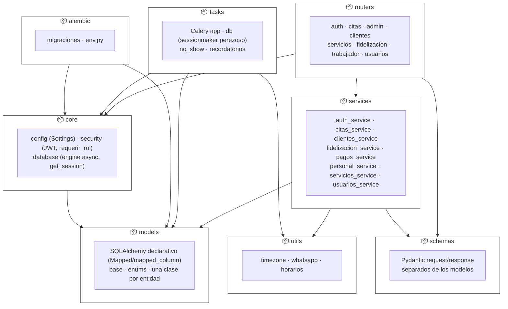
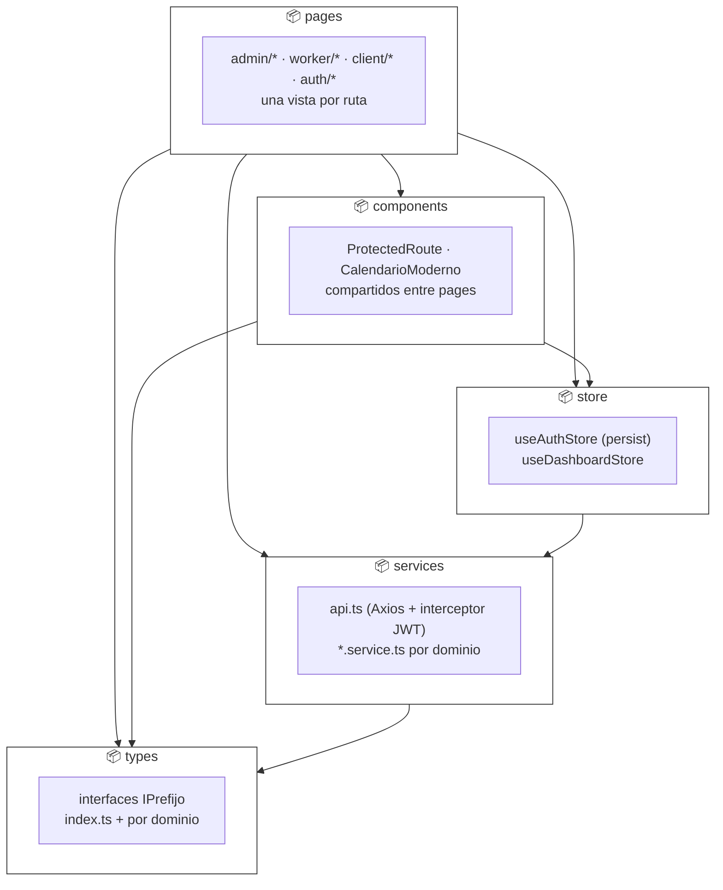

# Diagrama de Paquetes

Vista más abstracta que `09_DIAGRAMA_DE_COMPONENTES.md`: agrupa los componentes de ese diagrama
en **paquetes** (carpetas con una responsabilidad única) y muestra únicamente las dependencias
entre paquetes, no entre archivos individuales. Notación UML formal: `package` como contenedor,
flecha punteada abierta para la dependencia (`«import»`/`«access»` implícito) — Mermaid no tiene
un tipo `packageDiagram`, así que se aproxima con `flowchart` y subgrafos anidados, igual que
`02_CASOS_DE_USO_UML.md` aproxima el diagrama de casos de uso.

Regla de lectura: una flecha `A --> B` significa "A depende de B" (A importa símbolos de B), no
al revés — igual que una flecha UML de dependencia.

## Backend (`backend/app/`)

- **`routers` → `schemas`/`services`/`core`**: un router solo enruta — recibe `Depends(core.*)`,
  valida contra un `schema` y delega toda la lógica a un `service` (ver convención en
  `CLAUDE.md`, sección "Convenciones → Python").
- **`services` → `models`/`schemas`/`utils`**: toda la lógica de negocio y las reglas RN01–RN15
  viven aquí — es el único paquete que construye/modifica instancias de `models` y el único que
  llama a `utils/whatsapp.py`.
- **`core` → `models`**: `core/database.py` no depende de un modelo específico (`Base.metadata`
  es genérico), pero `alembic/env.py` sí necesita `target_metadata = Base.metadata` para
  autogenerate — de ahí la flecha `alembic → models`.
- No hay flecha `models → services` ni `models → routers`: los modelos no conocen a quién los
  usa (dirección de dependencia correcta, de afuera hacia adentro).

## Frontend (`frontend/src/`)

- **`pages` es el único paquete "hoja" del lado de arriba**: no lo importa nadie más — es
  correcto que un router (React Router v7, definido en `App.tsx`) sea el único consumidor.
- **`services` (frontend) → `types`**: cada `*.service.ts` tipa la respuesta de Axios contra la
  interfaz de dominio correspondiente antes de devolverla a quien lo llama.
- **`store` → `services`**: `useDashboardStore` llama a los `*.service.ts` de citas/pagos/
  personal para poblarse; no hay dependencia inversa (`services` nunca importa `store`).
- No hay flecha `types → *`: es el único paquete sin dependencias salientes, como corresponde a
  un paquete de solo definiciones.

## Dependencia entre los dos paquetes raíz

`backend` y `frontend` no se importan entre sí — la única relación es en tiempo de ejecución, vía
HTTP (`services/api.ts` → API REST expuesta por `routers`), fuera del alcance de un diagrama de
paquetes (esa relación ya está en `03_ARQUITECTURA_DEL_SISTEMA.md` y `10_DIAGRAMA_DE_DESPLIEGUE.md`).
